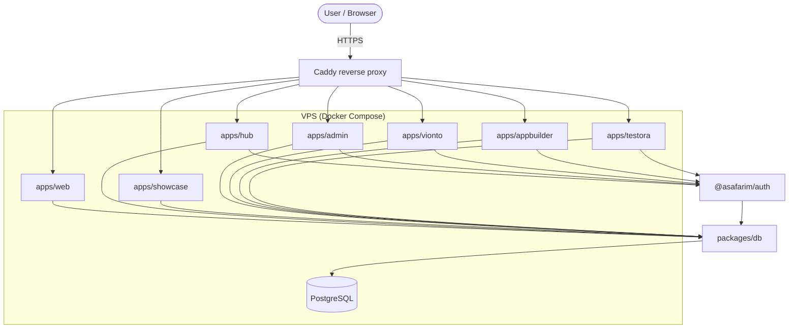
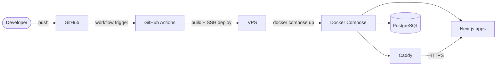

# ASafarIM Platform

Unified monorepo for all **ASafarIM Digital** apps and services: the public
website, the ASafarIM Hub dashboard, the Showcase, the Admin panel, and shared
packages — built with Next.js, TypeScript, PostgreSQL, pnpm workspaces, and
Turborepo, deployed with Docker Compose behind Caddy.

See [docs/migration-plan.md](docs/migration-plan.md) for the full plan,
[docs/architecture.md](docs/architecture.md) for the current structure, and
[docs/admin-console.md](docs/admin-console.md) for the app registry,
role/permission model, audit taxonomy, and platform settings.

## Architecture overview



## Apps

| App              | Purpose                        | Dev port | Target domain          | Access                      |
| ---------------- | ------------------------------ | -------- | ---------------------- | --------------------------- |
| `apps/web`       | Public ASafarIM Digital site   | 3000     | asafarim.com           | Public                      |
| `apps/hub`       | Logged-in user dashboard       | 3001     | hub.asafarim.com       | Login for dashboard/apps/profile/settings |
| `apps/showcase`  | Public demos and case studies  | 3002     | showcase.asafarim.be   | Public                      |
| `apps/admin`     | Internal admin panel           | 3003     | admin.asafarim.com     | admin / superadmin role     |
| `apps/vionto`    | AI photo-to-story video app    | 3004     | vionto.asafarim.com    | Login for projects/rendering (see [docs/vionto-architecture.md](docs/vionto-architecture.md)) |

Public website copy is maintained in `apps/web/content/`; PR-specific source,
asset, and deferral records are kept in `docs/migration-notes.md`.

## Packages

| Package             | Purpose                                          |
| ------------------- | ------------------------------------------------ |
| `packages/ui`       | Design system: tokens, brand, creative components (see [docs/design-system.md](docs/design-system.md)) |
| `packages/auth`     | Shared authentication helpers (Phase 5)          |
| `packages/db`       | Prisma client, schema, and migrations (Phase 4)  |
| `packages/config`   | Shared TypeScript/ESLint/Tailwind configuration  |
| `packages/shared-i18n` | Locale resolution, dictionaries, React i18n provider (used by Vionto) |
| `packages/country-language-selector` | Country/language picker UI (used by Vionto) |
| `packages/vionto-schemas` | Shared Vionto validation schemas |

## Getting started

Requirements: Node.js >= 22 and pnpm >= 11 (`corepack enable`).

```bash
pnpm install
pnpm dev        # run all apps in dev mode
pnpm build      # build all apps and packages
pnpm typecheck  # typecheck the whole workspace
```

### Environment

The four apps and database tooling use one root environment. Plaintext files
remain local; [Envage](https://alisafari-it.github.io/envage/) encrypts them to
age files that are safe to commit.

```bash
# First-time local setup
cp .env.local.example .env
pnpm env:key:init                 # once; back up .age/key.txt securely
pnpm env:encrypt:local            # writes .env.age

# Existing developer/machine
pnpm env:decrypt:local
pnpm env:status
```

Never commit `.env`, `.env.production`, or `.age/key.txt`. See
[docs/environment-management.md](docs/environment-management.md) for local,
production, key-distribution, rotation, and deployment procedures.

### Database

With the root `.env` in place:

```bash
docker compose up -d postgres   # local PostgreSQL on port 55435
pnpm db:migrate                 # apply Prisma migrations
pnpm db:seed                    # seed RBAC roles/permissions (+ SEED_ADMIN_* user)
pnpm db:studio                  # browse the database
```

Authentication (Auth.js v5) lives in `packages/auth`; sign in at
`hub:3001/sign-in`, admin-only area at `admin:3003`.

### Auth flow

```mermaid
flowchart LR
    User([User])
    App[Next.js app]
    Hub["hub.asafarim.com<br/>sign-in"]
    AuthPkg["@asafarim/auth"]
    DB[(PostgreSQL)]

    User -->|1. Open protected app| App
    App -->|2. Redirect to sign-in| Hub
    Hub -->|3. Credentials + callback| AuthPkg
    AuthPkg -->|4. Query user / session| DB
    AuthPkg -->|5. Set session cookie| Hub
    Hub -->|6. Redirect to callback URL| App
    App -->|7. auth() / API call| AuthPkg
    AuthPkg -->|8. Validate session| DB
```

## Deployment

Production runs on a VPS via Docker Compose and Caddy:

```bash
pnpm deploy:prod
```

### Deployment pipeline



See [docs/deployment.md](docs/deployment.md) for VPS setup details.
