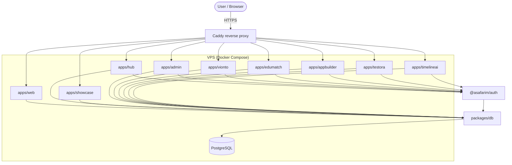
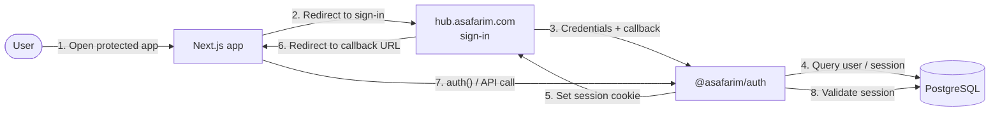
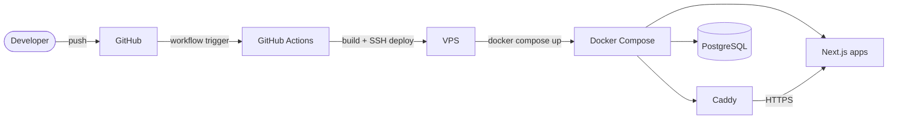

# ASafarIM Platform

Unified monorepo for all **ASafarIM Digital** apps and services: the public
website (web), the Hub dashboard, the Showcase, the Admin panel, Vionto
(AI photo-to-story video), EduMatch (AI learning support and tutor
marketplace), AppBuilder (metadata-driven AI application factory), Testora
(E2E test orchestration), TimelineAI (visual timeline creator), and shared
packages — built with Next.js, TypeScript, PostgreSQL, pnpm workspaces, and
Turborepo, deployed with Docker Compose behind Caddy.

See [docs/migration-plan.md](docs/migration-plan.md) for the full plan,
[docs/architecture.md](docs/architecture.md) for the current structure, and
[docs/admin-console.md](docs/admin-console.md) for the app registry,
role/permission model, audit taxonomy, and platform settings.

## Architecture overview


```mermaid
flowchart TD
    User([User / Browser])
    Caddy[Caddy reverse proxy]
    subgraph VPS ["VPS (Docker Compose)"]
        direction TB
        Web[apps/web]
        Hub[apps/hub]
        Showcase[apps/showcase]
        Admin[apps/admin]
        Vionto[apps/vionto]
        EduMatch[apps/edumatch]
        AppBuilder[apps/appbuilder]
        Testora[apps/testora]
        TimelineAI[apps/timelineai]
        Postgres[(PostgreSQL)]
    end
    Auth["@asafarim/auth"]
    DB["packages/db"]

    User -->|HTTPS| Caddy
    Caddy --> Web
    Caddy --> Hub
    Caddy --> Showcase
    Caddy --> Admin
    Caddy --> Vionto
    Caddy --> EduMatch
    Caddy --> AppBuilder
    Caddy --> Testora
    Caddy --> TimelineAI
    Web --> DB
    Hub --> DB
    Showcase --> DB
    Admin --> DB
    Vionto --> DB
    EduMatch --> DB
    AppBuilder --> DB
    Testora --> DB
    TimelineAI --> DB
    Hub --> Auth
    Admin --> Auth
    Vionto --> Auth
    EduMatch --> Auth
    AppBuilder --> Auth
    Testora --> Auth
    TimelineAI --> Auth
    Auth --> DB
    DB --> Postgres
```

## Apps

| App              | Purpose                        | Dev port | Target domain          | Access                      |
| ---------------- | ------------------------------ | -------- | ---------------------- | --------------------------- |
| [`apps/web`](apps/web/README.md)       | Public ASafarIM Digital site   | 3000     | asafarim.com           | Public                      |
| [`apps/hub`](apps/hub/README.md)       | Logged-in user dashboard       | 3001     | hub.asafarim.com       | Login for dashboard/apps/profile/settings |
| [`apps/showcase`](apps/showcase/README.md)  | Public demos and case studies  | 3002     | showcase.asafarim.com   | Public                      |
| [`apps/admin`](apps/admin/README.md)     | Internal admin panel           | 3003     | admin.asafarim.com     | admin / superadmin role     |
| [`apps/vionto`](apps/vionto/README.md)    | AI photo-to-story video app    | 3004     | vionto.asafarim.com    | Login for projects/rendering (see [docs/vionto-architecture.md](docs/vionto-architecture.md)) |
| [`apps/testora`](apps/testora/README.md)   | E2E test orchestration and runner | 3005  | testora.asafarim.com   | Login (shared SSO) |
| [`apps/appbuilder`](apps/appbuilder/README.md) | Metadata-driven AI application factory | 3006 | appbuilder.asafarim.com | Login (shared SSO); per-app owner/editor/viewer capabilities |
| [`apps/edumatch`](apps/edumatch/README.md) | AI learning support and tutor marketplace | 3009 | edumatch.asafarim.com | Public landing; login for student, tutor, and admin workspaces |
| [`apps/timelineai`](apps/timelineai/README.md) | Visual timeline creator (8 layouts, export, moderation) | 3010 | tlai.asafarim.com | Public gallery; login for dashboard/self-publish; guests can create/submit |

Public website copy is maintained in `apps/web/content/`; PR-specific source,
asset, and deferral records are kept in `docs/migration-notes.md`.

## Packages

| Package             | Purpose                                          |
| ------------------- | ------------------------------------------------ |
| `packages/ui`       | Design system: tokens, brand, creative components (see [docs/design-system.md](docs/design-system.md)) |
| `packages/auth`     | Shared authentication helpers (Auth.js v5, platform app registry, route proxy) |
| `packages/db`       | Prisma client, schema, and migrations for the shared platform database |
| `packages/config`   | Shared TypeScript/ESLint/Tailwind configuration  |
| `packages/shared-i18n` | Locale resolution, dictionaries, React i18n provider (used by Vionto) |
| `packages/country-language-selector` | Country/language picker UI (used by Vionto) |
| `packages/vionto-schemas` | Shared Vionto validation schemas |
| `packages/appbuilder-schema` | Versioned application-specification contract and deterministic controlled-operation engine for AppBuilder |
| `packages/appbuilder-runtime` | Approved component/template registry and metadata-driven preview renderer for AppBuilder generated apps |
| `packages/appbuilder-ai` | Server-only AI provider boundary and structured planning schemas for AppBuilder's generation pipeline |
| `packages/seed-manager` | Typed, allowlisted seed-data providers shared by the Admin Console and CLI seed scripts |
| `packages/storage` | Shared S3-compatible object storage utilities (DigitalOcean Spaces) |
| `packages/theme-toggle` | Shared light/dark theme toggle — provider, no-flash script, and toggle button |

## Getting started

Requirements: Node.js >= 22 and pnpm >= 11 (`corepack enable`).

```bash
pnpm install
pnpm dev        # run all apps in dev mode
pnpm build      # build all apps and packages
pnpm typecheck  # typecheck the whole workspace
```

### Environment

The apps and database tooling use one root environment. Plaintext files
remain local; [Envage](https://alisafari-it.github.io/envage/) encrypts them to
age files that are safe to commit.

```bash
# First-time local setup
cp .env.local.example .env
pnpm env:key:init                 # once; back up .age/key.txt securely
pnpm env:encrypt:local            # writes .env.age

# Existing developer/machine
pnpm env:decrypt:local
pnpm env:status
```

Never commit `.env`, `.env.production`, or `.age/key.txt`. See
[docs/environment-management.md](docs/environment-management.md) for local,
production, key-distribution, rotation, and deployment procedures.

### Database

With the root `.env` in place:

```bash
docker compose up -d postgres   # local PostgreSQL on port 55435
pnpm db:migrate                 # apply Prisma migrations
pnpm db:seed                    # seed RBAC roles/permissions (+ SEED_ADMIN_* user)
pnpm db:studio                  # browse the database
```

Authentication (Auth.js v5) lives in `packages/auth`; sign in is centralized
at `hub:3001/sign-in`. Every protected app (Hub, Admin, Vionto, EduMatch,
AppBuilder, Testora, TimelineAI) shares the same session via a `.asafarim.com`
cookie — there is no per-app login.

### Auth flow


```mermaid
flowchart LR
    User([User])
    App[Next.js app]
    Hub["hub.asafarim.com<br/>sign-in"]
    AuthPkg["@asafarim/auth"]
    DB[(PostgreSQL)]

    User -->|"1. Open protected app"| App
    App -->|"2. Redirect to sign-in"| Hub
    Hub -->|"3. Credentials + callback"| AuthPkg
    AuthPkg -->|"4. Query user / session"| DB
    AuthPkg -->|"5. Set session cookie"| Hub
    Hub -->|"6. Redirect to callback URL"| App
    App -->|"7. auth() / API call"| AuthPkg
    AuthPkg -->|"8. Validate session"| DB
```

## Deployment

Production runs on a VPS via Docker Compose and Caddy:

```bash
pnpm deploy:prod
```

### Deployment pipeline


```mermaid
flowchart LR
    Dev([Developer])
    GH[GitHub]
    Actions[GitHub Actions]
    VPS[VPS]
    Docker[Docker Compose]
    Caddy[Caddy]
    Apps[Next.js apps]
    DB[(PostgreSQL)]

    Dev -->|push| GH
    GH -->|workflow trigger| Actions
    Actions -->|build + SSH deploy| VPS
    VPS -->|docker compose up| Docker
    Docker --> Apps
    Docker --> Caddy
    Caddy -->|HTTPS| Apps
    Docker --> DB
```

See [docs/deployment.md](docs/deployment.md) for VPS setup details.

## 📄 License & Evaluation Notice

This repository is a **portfolio project**, shared publicly so recruiters,
hiring managers, and prospective employers can review real, working code as
part of a skills assessment. It is licensed under a custom
**Portfolio Evaluation & Source-Available License** — see [`./LICENSE`](./LICENSE)
for the full legal text.

**Permitted:**

- 👀 Viewing and reading the source code
- 📥 Cloning the repository for local inspection
- 🖥️ Building and running the project locally, for evaluation, skills
  assessment, or personal review as part of a hiring process

**Forbidden without prior written consent:**

- 🚫 Commercial use of any kind, including SaaS or hosted deployments
- 🚫 Selling, renting, or paid distribution of the code
- 🚫 Sublicensing or redistributing the code to third parties
- 🚫 Modifying the code to create commercial derivative works
- 🚫 Re-publishing or re-hosting this source code on another repository or platform

For commercial licensing, collaboration, or any use beyond personal
evaluation, please reach out: **asafarim@gmail.com**
