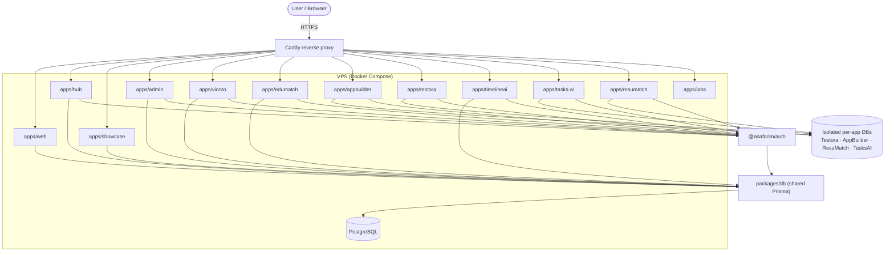
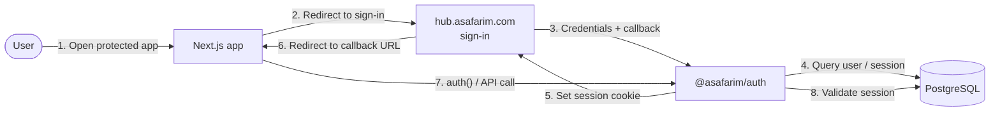
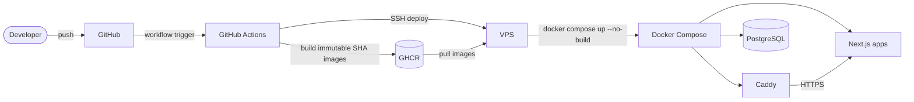

# ASafarIM Platform

Unified monorepo for all **ASafarIM Digital** apps and services: the public
website (web), the Hub dashboard, the Showcase, the Admin panel, Vionto
(AI photo-to-story video), EduMatch (AI learning support and tutor
marketplace), AppBuilder (metadata-driven AI application factory), Testora
(E2E test automation), TimelineAI (visual timeline creator), TasksAI
(AI-native work execution), ResuMatch (AI CV tailoring, cover letters,
and application tracking),
Labs (experimental workbench), and shared packages — built with Next.js,
TypeScript, PostgreSQL, pnpm workspaces, and Turborepo. Images are built in
GitHub Actions, published to GHCR, and pulled by the VPS, which runs them
with Docker Compose behind Caddy.

See [docs/migration-plan.md](docs/migration-plan.md) for the full plan,
[docs/architecture.md](docs/architecture.md) for the current structure,
[docs/admin-console.md](docs/admin-console.md) for the app registry,
role/permission model, audit taxonomy, and platform settings, and
[docs/admin-settings-api.md](docs/admin-settings-api.md) for how apps read
those settings (including the internal-API trust boundary).

## Architecture overview


```mermaid
flowchart TD
    User([User / Browser])
    Caddy[Caddy reverse proxy]
    subgraph VPS ["VPS (Docker Compose)"]
        direction TB
        Web[apps/web]
        Hub[apps/hub]
        Showcase[apps/showcase]
        Admin[apps/admin]
        Vionto[apps/vionto]
        EduMatch[apps/edumatch]
        AppBuilder[apps/appbuilder]
        Testora[apps/testora]
        TimelineAI[apps/timelineai]
        TasksAI[apps/tasks-ai]
        ResuMatch[apps/resumatch]
        Labs[apps/labs]
        Postgres[(PostgreSQL)]
    end
    Auth["@asafarim/auth"]
    DB["packages/db (shared Prisma)"]
    IsolatedDB[(Isolated per-app DBs<br/>Testora · AppBuilder · ResuMatch · TasksAI)]

    User -->|HTTPS| Caddy
    Caddy --> Web
    Caddy --> Hub
    Caddy --> Showcase
    Caddy --> Admin
    Caddy --> Vionto
    Caddy --> EduMatch
    Caddy --> AppBuilder
    Caddy --> Testora
    Caddy --> TimelineAI
    Caddy --> TasksAI
    Caddy --> ResuMatch
    Caddy --> Labs
    Web --> DB
    Hub --> DB
    Showcase --> DB
    Admin --> DB
    Vionto --> DB
    EduMatch --> DB
    TimelineAI --> DB
    AppBuilder --> IsolatedDB
    Testora --> IsolatedDB
    ResuMatch --> IsolatedDB
    TasksAI --> IsolatedDB
    Hub --> Auth
    Admin --> Auth
    Vionto --> Auth
    EduMatch --> Auth
    AppBuilder --> Auth
    Testora --> Auth
    TimelineAI --> Auth
    TasksAI --> Auth
    ResuMatch --> Auth
    Auth --> DB
    DB --> Postgres
```

Labs is deliberately outside this graph's data layer: no auth, no shared or
isolated database — a static, typed experiment registry only.

Isolated-DB apps still read platform settings: they call Admin's
`GET /api/internal/settings` over HTTP with a shared `INTERNAL_API_SECRET`
bearer instead of touching the platform database (see
[docs/admin-settings-api.md](docs/admin-settings-api.md)).

## Key Platform Features

### Unified Authentication
- **Single Sign-On**: Centralized authentication via Hub (Auth.js v5) across all protected apps
- **Shared Session**: `.asafarim.com` cookie provides seamless app switching
- **Role-Based Access Control**: Admin panel manages roles, permissions, and app access
- **Platform App Registry**: Dynamic app discovery and access control per user role

### Architecture Patterns
- **Shared vs Isolated Databases**: Strategic separation of platform data from app-specific data
- **Internal API Trust Boundary**: Secure cross-app communication via `INTERNAL_API_SECRET`
- **AI Cost Tracking**: Vendor-neutral cost event contract for monitoring AI usage across apps
- **Cross-App Contracts**: Versioned schemas for app integration (e.g., Testora ↔ TasksAI)

### Development Experience
- **Monorepo Structure**: pnpm workspaces with Turborepo for efficient builds
- **Shared Packages**: Reusable UI components, auth helpers, database access, and utilities
- **Type Safety**: Full TypeScript coverage with strict type checking
- **Docker Compose**: Local development and production deployment consistency

## Apps

| App              | Purpose                        | Dev port | Target domain          | Access                      |
| ---------------- | ------------------------------ | -------- | ---------------------- | --------------------------- |
| [`apps/web`](apps/web/README.md)       | Public ASafarIM Digital site   | 3000     | asafarim.com           | Public                      |
| [`apps/hub`](apps/hub/README.md)       | Logged-in user dashboard       | 3001     | hub.asafarim.com       | Login for dashboard/apps/profile/settings |
| [`apps/showcase`](apps/showcase/README.md)  | Public demos and case studies  | 3002     | showcase.asafarim.com   | Public                      |
| [`apps/admin`](apps/admin/README.md)     | Internal admin panel           | 3003     | admin.asafarim.com     | admin / superadmin role     |
| [`apps/vionto`](apps/vionto/README.md)    | AI photo-to-story video app    | 3004     | vionto.asafarim.com    | Login for projects/rendering (see [docs/vionto-architecture.md](docs/vionto-architecture.md)) |
| [`apps/testora`](apps/testora/README.md)   | E2E test automation (requirements, suites, TestCafe runs) | 3005  | testora.asafarim.com   | Login (shared SSO) |
| [`apps/appbuilder`](apps/appbuilder/README.md) | Metadata-driven AI application factory | 3006 | appbuilder.asafarim.com | Login (shared SSO); per-app owner/editor/viewer capabilities |
| [`apps/edumatch`](apps/edumatch/README.md) | AI learning support and tutor marketplace | 3009 | edumatch.asafarim.com | Public landing; login for student, tutor, and admin workspaces |
| [`apps/timelineai`](apps/timelineai/README.md) | Visual timeline creator (8 layouts, export, moderation, optional AI copilot) | 3010 | tlai.asafarim.com | Public gallery; login for dashboard/self-publish; guests can create/submit |
| [`apps/labs`](apps/labs/README.md) | Experimental workbench — what's being explored next | 3011 | labs.asafarim.com | Public; no login, no database |
| [`apps/resumatch`](apps/resumatch/README.md) | AI CV tailoring and cover letters under a no-fabrication contract, plus application tracking; UI in EN/NL/FR/DE | 3012 | resumatch.asafarim.com | Login (shared SSO); isolated Postgres |
| [`apps/tasks-ai`](apps/tasks-ai/README.md) | AI-native work execution — capture, plan, execute | 3013 | tasks-ai.asafarim.com | Login (shared SSO); isolated Postgres |

Public website copy is maintained in `apps/web/content/`; PR-specific source,
asset, and deferral records are kept in `docs/migration-notes.md`.

## Packages

| Package             | Purpose                                          |
| ------------------- | ------------------------------------------------ |
| `packages/ui`       | Design system: tokens, brand, creative components (see [docs/design-system.md](docs/design-system.md)) |
| `packages/auth`     | Shared authentication helpers (Auth.js v5, platform app registry, route proxy, SMTP mailer) |
| `packages/db`       | Prisma client, schema, and migrations for the shared platform database |
| `packages/config`   | Shared TypeScript/ESLint/Tailwind configuration  |
| `packages/shared-i18n` | Locale resolution, dictionaries, React i18n provider, plus the `shell.*` wording `@asafarim/ui` and `@asafarim/theme-toggle` accept as labels (used by Vionto, Hub, Showcase, Admin, EduMatch, TimelineAI, ResuMatch) |
| `packages/country-language-selector` | Country/language picker UI (used by Vionto) |
| `packages/vionto-schemas` | Shared Vionto validation schemas |
| `packages/appbuilder-schema` | Versioned application-specification contract and deterministic controlled-operation engine for AppBuilder |
| `packages/appbuilder-runtime` | Approved component/template registry and metadata-driven preview renderer for AppBuilder generated apps |
| `packages/appbuilder-ai` | Server-only AI provider boundary and structured planning schemas for AppBuilder's generation pipeline |
| `packages/seed-manager` | Typed, allowlisted seed-data providers shared by the Admin Console and CLI seed scripts |
| `packages/storage` | Shared S3-compatible object storage utilities (DigitalOcean Spaces) |
| `packages/theme-toggle` | Shared light/dark theme toggle — provider, no-flash script, and toggle button |
| `packages/testora-tasksai-contract` | Versioned cross-app contract between Testora and TasksAI (artifact-bundle, provision, webhook-event, green-light schemas, HMAC signing) — no framework/DB/AI dependency |
| `packages/ai-cost-ledger` | Vendor-neutral, append-only AI provider cost-event contract (integer-micro money, exclusive usage buckets, pricing snapshots, coverage aggregation, timeline read model) — each app persists it in its own DB; see `docs/adr/0003-ai-cost-event-contract.md` |
| `packages/agent-assurance-contract` | Vendor-neutral executable agent promises, strict run-evidence schemas, and deterministic pass/fail/inconclusive evaluation |
| `packages/activity` | Cross-app user-activity adapters for the superadmin User 360 explorer |
| `packages/settings-client` | Read-only HTTP client for Admin's internal platform-settings API — used by isolated-DB apps (Testora, AppBuilder, ResuMatch, TasksAI); no Next.js/DB/auth dependency |

## Getting started

Requirements: Node.js >= 22 and pnpm >= 11 (`corepack enable`).

```bash
pnpm install
pnpm dev        # run all apps in dev mode
pnpm build      # build all apps and packages
pnpm typecheck  # typecheck the whole workspace
```

## Contributing

For bug reports, feature requests, or general issues, please use the GitHub issue templates in `.github/ISSUE_TEMPLATE/`:

- **Bug report** - Report bugs with steps to reproduce and environment details
- **Feature request** - Suggest new features with problem statements and proposed solutions
- **General issue** - Questions, documentation, or other non-bug/non-feature issues

All templates include app/package selection for the 12 apps and 16 packages in the platform.

### Environment

The apps and database tooling use one root environment. Plaintext files
remain local; [Envage](https://alisafari-it.github.io/envage/) encrypts them to
age files that are safe to commit.

```bash
# First-time local setup
cp .env.local.example .env
pnpm env:key:init                 # once; back up .age/key.txt securely
pnpm env:encrypt:local            # writes .env.age

# Existing developer/machine
pnpm env:decrypt:local
pnpm env:status
```

Never commit `.env`, `.env.production`, or `.age/key.txt`. See
[docs/environment-management.md](docs/environment-management.md) for local,
production, key-distribution, rotation, and deployment procedures.

### Database

With the root `.env` in place:

```bash
docker compose up -d postgres   # local PostgreSQL on port 55435
pnpm db:migrate                 # apply Prisma migrations
pnpm db:seed                    # seed RBAC roles/permissions (+ SEED_ADMIN_* user)
pnpm db:studio                  # browse the database
```

Authentication (Auth.js v5) lives in `packages/auth`; sign in is centralized
at `hub:3001/sign-in`. Every protected app (Hub, Admin, Vionto, EduMatch,
AppBuilder, Testora, TimelineAI, TasksAI, ResuMatch) shares the same session
via a `.asafarim.com` cookie — there is no per-app login. Labs is public and
has no session at all.

Machine-to-machine calls are separate: each app's `/api/internal/*` endpoints
authenticate themselves with a shared `INTERNAL_API_SECRET` bearer, not
sessions. Admin-console "secret" settings (SMTP/Stripe/AI keys) are encrypted
at rest with `SETTINGS_ENCRYPTION_KEY`.

### Auth flow


```mermaid
flowchart LR
    User([User])
    App[Next.js app]
    Hub["hub.asafarim.com<br/>sign-in"]
    AuthPkg["@asafarim/auth"]
    DB[(PostgreSQL)]

    User -->|"1. Open protected app"| App
    App -->|"2. Redirect to sign-in"| Hub
    Hub -->|"3. Credentials + callback"| AuthPkg
    AuthPkg -->|"4. Query user / session"| DB
    AuthPkg -->|"5. Set session cookie"| Hub
    Hub -->|"6. Redirect to callback URL"| App
    App -->|"7. auth() / API call"| AuthPkg
    AuthPkg -->|"8. Validate session"| DB
```

## Deployment

Production runs on a VPS via Docker Compose and Caddy — every app, worker,
and migrator image runs as a non-root user:

```bash
pnpm deploy:prod
```

### Deployment pipeline


```mermaid
flowchart LR
    Dev([Developer])
    GH[GitHub]
    Actions[GitHub Actions]
    VPS[VPS]
    Docker[Docker Compose]
    Caddy[Caddy]
    Apps[Next.js apps]
    DB[(PostgreSQL)]

    Dev -->|push| GH
    GH -->|workflow trigger| Actions
    Registry[(GHCR)]

    Actions -->|build immutable SHA images| Registry
    Actions -->|SSH deploy| VPS
    Registry -->|pull images| VPS
    VPS -->|docker compose up --no-build| Docker
    Docker --> Apps
    Docker --> Caddy
    Caddy -->|HTTPS| Apps
    Docker --> DB
```

See [docs/deployment.md](docs/deployment.md) for VPS setup details.

## 📄 License & Evaluation Notice

This repository is a **portfolio project**, shared publicly so recruiters,
hiring managers, and prospective employers can review real, working code as
part of a skills assessment. It is licensed under a custom
**Portfolio Evaluation & Source-Available License** — see [`./LICENSE`](./LICENSE)
for the full legal text.

**Permitted:**

- 👀 Viewing and reading the source code
- 📥 Cloning the repository for local inspection
- 🖥️ Building and running the project locally, for evaluation, skills
  assessment, or personal review as part of a hiring process

**Forbidden without prior written consent:**

- 🚫 Commercial use of any kind, including SaaS or hosted deployments
- 🚫 Selling, renting, or paid distribution of the code
- 🚫 Sublicensing or redistributing the code to third parties
- 🚫 Modifying the code to create commercial derivative works
- 🚫 Re-publishing or re-hosting this source code on another repository or platform

For commercial licensing, collaboration, or any use beyond personal
evaluation, please reach out: **asafarim@gmail.com**
