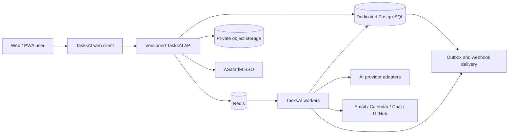

# Task Management - AI-Native Work Execution Business Plan

**Plan date:** 5 September 2026  
**Product name:** Task Management  
**Technical identifier:** `tasks-ai` / `@asafarim/tasks-ai`  
**Target domain:** `tasks-ai.asafarim.com`  
**Stage:** Product concept and delivery plan; no application is implemented yet  
**Initial market:** Belgium and neighboring EU markets  
**Initial customer:** Client-service and product teams with 5-50 people

> **Working promise:** From scattered intent to trusted execution.

## Executive context and current-state truth

This plan is grounded in the repository as it exists on the plan date.

- `apps/tasks-ai` contains this documentation directory only. There is no TasksAI package, web client, API, database schema, worker, test suite, or deployment configuration yet.
- The previous Showcase copy described Task Management as a beta inherited from an earlier ecosystem. This planning change replaces that placeholder with an honest `planned` entry; it was not evidence that the vertical already existed in this repository.
- AppBuilder contains a generic task-management template. It is useful as a specification/runtime fixture, but it is not a substitute for this multi-tenant product.
- The ASafarIM Platform provides reusable SSO, UI, PostgreSQL, object storage, Redis/BullMQ, Docker Compose, Caddy, test, and deployment conventions.
- The repository license permits portfolio evaluation and personal non-commercial review. A written commercial license or relicensing decision is a hard gate before accepting payment or operating this plan as a commercial SaaS.
- The display name requested for the product is intentionally retained. A trademark, domain, and search-confusion review is required because generic `Tasks AI` and `TaskAI` names are already used by unrelated products.

Relevant repository references:

- [Platform overview](../../../README.md)
- [Current Showcase entry](../../showcase/app/projects/data.ts)
- [Generic AppBuilder task template](../../../packages/appbuilder-runtime/src/templates/taskManagement.ts)
- [Platform application registry](../../../packages/auth/src/apps.ts)
- [Cross-application URL registry](../../../packages/ui/src/links.ts)
- [Repository license](../../../LICENSE)

---

# 1. Executive Summary

## The problem

Task software is abundant, but reliable execution remains difficult. Small teams usually do not fail because they cannot create a card. They fail because:

1. **Intent arrives unstructured.** Commitments are scattered across meetings, email, chat, documents, and individual memory.
2. **Structure is expensive.** A person must repeatedly translate that intent into tasks, owners, dependencies, dates, acceptance criteria, and status updates.
3. **Priority is opaque.** Urgency, impact, blocked work, capacity, and strategic goals compete, while most tools expose lists rather than decisions.
4. **Coordination leaks into chat.** Decisions and handoffs become detached from the work they affect.
5. **Reporting becomes theater.** Teams spend time reconstructing status for managers instead of completing outcomes.
6. **AI often reduces trust.** A chatbot that silently edits dates, invents requirements, or reassigns people creates more review work and operational risk.
7. **Feature-heavy products impose adoption tax.** Smaller teams pay for broad suites, complex configuration, and opaque AI limits before they establish a useful habit.

## The solution

Task Management is a calm, API-first work operating system built around an **outcome-linked work graph** and an **explainable proposal engine**.

It turns unstructured intent into structured work through five connected loops:

1. **Capture** - collect commitments from quick entry, pasted notes, email, meetings, API, and integrations.
2. **Clarify** - identify missing owners, dates, dependencies, acceptance criteria, and assumptions.
3. **Commit** - review a visible proposal diff, then accept all, accept part, edit, reject, or defer it.
4. **Coordinate** - collaborate around the task with comments, evidence, activity, notifications, automations, and handoffs.
5. **Close and learn** - connect completion to an outcome, inspect flow and risk, and improve future planning.

The AI does not own the plan. It proposes a plan, explains its evidence and uncertainty, estimates the effect of the change, and waits for approval.

## Positioning

> **Task Management is the execution system for small teams that want AI to reduce coordination work without surrendering control of their work.**

The product will compete on:

- time to trusted structure, not number of configuration options;
- explainable recommendations, not unexplained scores;
- reversible proposals, not autonomous mutation;
- outcome and dependency context, not isolated task cards;
- a stable API and portable data, not lock-in;
- EU-first privacy and operational transparency;
- speed, keyboard fluency, and progressive disclosure;
- useful non-AI workflows that continue when a model provider is unavailable.

## Initial business hypothesis

Teams of 5-50 in consulting, agencies, software, data, and other project-based services will pay EUR 9-18 per active member per month when the product demonstrably:

- creates a usable project plan in minutes;
- reduces manual follow-up and status preparation;
- reveals blockers and schedule risk early;
- remains easier to adopt than broad work-management suites; and
- makes AI usage, evidence, and cost understandable.

This is a hypothesis to validate with design partners, not a forecast.

## Strategic wedge

The launch wedge is **brief-to-execution for client-service and product teams**:

```text
Client brief / product intent
            |
            v
Structured project proposal
            |
            v
Human review and commitment
            |
            v
Outcome-linked tasks and dependencies
            |
            v
Focus, risk, and follow-up guidance
            |
            v
Delivery evidence and reusable learning
```

This is narrower and more defensible than trying to replace every feature in Asana, monday.com, ClickUp, Notion, Jira, and Linear at launch.

---

# 2. Customer, Market, and Jobs to Be Done

## Initial ideal customer profile

The primary customer is an EU-based team that:

- has 5-50 members;
- delivers client projects or digital products;
- coordinates through a mix of email, chat, meetings, documents, and an existing task tool;
- has a team lead or operations owner who reconstructs status manually;
- experiences missed handoffs, stale tasks, or recurring priority debates;
- values fast adoption more than deep enterprise configurability;
- is willing to pilot an AI-assisted workflow with human approval; and
- can identify one repeatable project type for a design-partner experiment.

### Beachhead segments

1. **Digital consultancies and implementation teams** - recurring briefs, dependencies, client deadlines, and handoffs.
2. **Creative and technical agencies** - multiple concurrent client projects, approval cycles, and external guests.
3. **Software and data product teams** - issue intake, planning, dependencies, release goals, and GitHub integration.
4. **Internal operations teams in digitally mature SMEs** - repeatable workflows currently coordinated in spreadsheets and chat.

The first release should not target construction, healthcare delivery, public safety, legal case management, or regulated employee decision-making. Those require domain-specific controls and validation.

## Buyer and user roles

| Role                        | Primary pain                                           | Purchase or adoption criterion                                    |
| --------------------------- | ------------------------------------------------------ | ----------------------------------------------------------------- |
| Founder / managing director | Delivery visibility without more meetings              | Fast onboarding, predictable price, visible project risk          |
| Delivery or operations lead | Manual status chasing and inconsistent process         | Reusable templates, workload view, automations, portfolio health  |
| Project or product lead     | Ambiguous scope, dependencies, and changing priorities | Brief-to-plan, clear ownership, explainable prioritization        |
| Individual contributor      | Tool maintenance competes with real work               | Fast capture, My Work, quiet notifications, useful daily focus    |
| Client or guest             | Cannot see what needs review                           | Narrow access, simple approval and comment flow                   |
| IT / security reviewer      | New AI and data processor risk                         | DPA, audit, access controls, provider policy, export and deletion |

## Core jobs to be done

- When a new brief arrives, help me turn it into a credible plan before the kickoff.
- When priorities compete, show me what should move first and why.
- When delivery risk changes, tell me which dependency or assumption changed.
- When someone asks for status, produce an evidence-linked summary without a reporting meeting.
- When a teammate joins, show the relevant context and decisions without exposing the whole workspace.
- When AI suggests a change, show exactly what will change and let me reverse it.
- When I leave the product, let me export the work in a documented format.

## Market evidence

The product enters a large but crowded category. Top-down market estimates should be treated as directional because analyst definitions vary. One published estimate places the task-management software category at USD 5.1 billion in 2025 and USD 5.87 billion in 2026. The business case should not depend on that estimate.

More decision-useful evidence is the initial regional context:

- The European Commission reports approximately **34 million EU SMEs** in 2025.
- Belgium reported **84.35% of SMEs at or above basic digital intensity** in the 2025 data, above the EU average reported in the 2026 Digital Decade material.
- Statbel reports **34.5% of Belgian enterprises used at least one AI technology in 2025**.
- Eurostat reports **20.0% of EU enterprises with at least 10 workers used AI in 2025**, up 6.5 percentage points from 2024.

These figures support digital readiness and rising AI adoption. They do not prove willingness to switch task-management products.

## Bottom-up market model

The first market model uses explicit assumptions instead of an inflated global TAM claim.

| Layer                        |                                                   Planning assumption |                          Calculation | Annual subscription value |
| ---------------------------- | --------------------------------------------------------------------: | -----------------------------------: | ------------------------: |
| Beachhead serviceable market | 25,000 suitable organizations in Belgium, Netherlands, and Luxembourg | 25,000 x 10 paid seats x EUR 15 x 12 |                 EUR 45.0M |
| Initial obtainable market    |                                                           1,000 teams |  1,000 x 10 paid seats x EUR 15 x 12 |                  EUR 1.8M |
| Validation cohort            |                                             5-10 design-partner teams |  Research cohort, not revenue target |            Not applicable |

The organization count, average seats, and price are planning assumptions. M00 must replace them with sourced business-register segmentation and customer research before they appear in fundraising material.

---

# 3. Competitive Strategy

## Competitive landscape

Prices below are public list prices observed on 5 September 2026, generally per member per month with annual billing. Currency, geography, tax, promotions, AI credits, minimum seats, and packaging vary; pricing must be rechecked before external use.

| Product          | Public entry signal                                 | AI direction                                | Strategic lesson for Task Management                                       |
| ---------------- | --------------------------------------------------- | ------------------------------------------- | -------------------------------------------------------------------------- |
| Asana            | Starter around USD 10.99; Advanced around USD 24.99 | AI Studio and credit-based workflows        | Outcome and portfolio depth is strong; avoid competing feature-for-feature |
| monday.com       | Basic USD 9; Standard USD 12; Pro USD 19            | Sidekick, agents, AI columns, credits       | Configurability is powerful but can add setup and pricing complexity       |
| ClickUp          | Unlimited USD 7; Business USD 12                    | Brain AI and higher AI bundles              | Low entry price and breadth are hard to beat; win on calm UX and trust     |
| Notion           | Plus around USD 10; Business around USD 20          | Agent, meeting notes, search, agent credits | Documents plus databases are flexible; win on execution semantics and flow |
| Linear           | Basic USD 10; Business USD 16                       | Triage and agent platform                   | Speed and opinionated UX matter; serve broader client-service workflows    |
| Motion / Reclaim | Roughly USD 10-29 depending on product and tier     | Scheduling and calendar optimization        | Personal scheduling is valuable, but it is only one part of team execution |

## Durable differentiation

AI task extraction alone is not a moat. Every incumbent can add it. The defensible system is the combination of:

1. **A versioned work graph** connecting outcomes, tasks, dependencies, decisions, evidence, people, and time.
2. **A proposal protocol** that describes intended changes independently of any model provider.
3. **Outcome-specific evaluation data** built from consented or synthetic brief-to-plan and risk examples.
4. **Workflow memory** based on approved team patterns, not uncontrolled model memory.
5. **A low-friction experience** that can be learned in one session and remains fast at scale.
6. **API and data portability** that make integrations and agents predictable.
7. **Trust operations** including provenance, approval, undo, budget controls, and transparent failure.

## Strategic non-goals

The launch product will not:

- clone every field, view, or marketplace integration of large incumbents;
- generate or run arbitrary code;
- silently delete, reassign, reschedule, or send messages;
- infer employee personality, emotion, health, or protected characteristics;
- rank employee performance or make employment decisions;
- record keystrokes, screenshots, or background activity;
- train foundation models on customer content by default;
- replace accounting, payroll, CRM, source control, or document suites; or
- promise that an AI-generated estimate or delivery date is correct.

---

# 4. Product and Experience Plan

## Product principles

1. **Useful before AI.** Core task, project, collaboration, and search workflows must survive a provider outage.
2. **One model of work.** List, board, calendar, timeline, portfolio, API, and AI operate on one domain rather than duplicate view-specific records.
3. **Progressive disclosure.** New teams see a simple product; advanced fields, views, automation, and administration appear when needed.
4. **Every suggestion is inspectable.** Evidence, assumptions, confidence, impact, model/prompt version, and cost are available.
5. **Every material action is reversible or explicitly irreversible.** The product previews the blast radius before approval.
6. **Quiet by default.** Notifications are bundled and actionable rather than generated for every event.
7. **Portability is a feature.** Import, export, API versioning, and webhook behavior are product commitments.
8. **Accessibility is a release criterion.** Keyboard and screen-reader alternatives are not deferred polish.

## Core information architecture

| Surface           | Purpose                                                                                      |
| ----------------- | -------------------------------------------------------------------------------------------- |
| Home              | Public product explanation and design-partner invitation                                     |
| Dashboard         | Personal commitments, team pulse, deadlines, and suggested next actions                      |
| Inbox             | Unprocessed captures and AI proposals awaiting clarification or approval                     |
| My Work           | Cross-project tasks grouped by commitment, focus, waiting, and review                        |
| Projects          | Project catalog, templates, ownership, health, and portfolio grouping                        |
| Project workspace | List, board, calendar, timeline, goals, files, activity, and settings                        |
| Task detail       | Context, description, acceptance criteria, relationships, assignees, discussion, and history |
| Goals and cycles  | Outcomes, key results, milestones, sprints/cycles, and linked delivery evidence              |
| Search            | Authorized keyword, structured, and later semantic search                                    |
| Automations       | Trigger-condition-action rules with dry run and execution history                            |
| Integrations      | Connections, scopes, sync health, and revocation                                             |
| Reports           | Flow, risk, workload, predictability, and outcome progress                                   |
| Admin             | Membership, roles, security, retention, audit, usage, AI budgets, and billing                |

## Signature workflows

### Brief to project

1. Paste or import a brief.
2. Detect objectives, deliverables, constraints, dates, stakeholders, risks, and missing information.
3. Generate a draft work graph with citations and explicit assumptions.
4. Show the operation diff and predicted blast radius.
5. Let the owner edit or partially accept it.
6. Apply accepted operations transactionally and produce an undo record.

### Daily focus

1. Gather assigned and watched work the user can access.
2. Apply deterministic facts: due dates, blocked state, commitments, dependencies, and capacity.
3. Optionally use AI to summarize context and suggest ordering.
4. Show factors, confidence, and conflicts.
5. Let the user pin, snooze, or reject suggestions without changing source facts.

### Project pulse

1. Detect blocked chains, aging work, scope growth, missing ownership, due-date pressure, and recent change.
2. Separate rules from model interpretation.
3. Produce a concise status draft linked to evidence.
4. Require review before publishing or sending it.
5. Learn only from explicit corrections and approved patterns.

## Proposal protocol

Every AI-generated change should conform to a provider-neutral contract similar to:

```text
proposal_id
workspace_id
actor_id
purpose
source_references[]
assumptions[]
confidence
operations[]
impact_summary
warnings[]
estimated_ai_cost
prompt_version
model_version
created_at
expires_at
undo_plan
```

Allowed proposal states:

```text
draft -> reviewed -> applied -> reverted
   |         |
   +-------> rejected
   +-------> expired
```

The model never receives database credentials or an unrestricted mutation tool. Application code validates each proposed operation, authorization, current record version, and blast-radius limit before it can be presented or applied.

## Initial templates

Templates are onboarding accelerators, not separate product verticals:

- client implementation;
- website or campaign delivery;
- software release;
- consulting engagement;
- recurring operations cycle; and
- personal professional project.

A template should include outcomes, statuses, roles, example automations, and reporting defaults while remaining fully editable.

---

# 5. AI Product Strategy and Responsible Use

## AI capability ladder

| Level | Capability                                       | Release condition                                                         |
| ----- | ------------------------------------------------ | ------------------------------------------------------------------------- |
| 0     | Deterministic task management, rules, and search | Must work without a model provider                                        |
| 1     | Extraction and summarization                     | Structured evals, evidence links, approval required                       |
| 2     | Decomposition and planning proposals             | Operation validation, partial acceptance, undo                            |
| 3     | Focus, risk, and workload suggestions            | Explainable factors, confidence, feedback, fairness review                |
| 4     | Bounded workflow agents                          | Narrow scopes, budget, dry run, audit, kill switch                        |
| 5     | Higher-autonomy actions                          | Not on the committed roadmap; requires a new safety and business decision |

## Initial AI features

- natural-language inbox parsing;
- brief-to-project proposal;
- task and acceptance-criteria decomposition;
- missing-information questions;
- duplicate and dependency suggestions;
- evidence-linked status summaries;
- explainable focus suggestions;
- project risk and blocker narratives;
- meeting-note action extraction;
- semantic query assistance; and
- draft comments, follow-ups, and stakeholder updates.

## Guardrails

- Real model calls are server-only and provider-neutral.
- Development and CI default to deterministic fixture providers with no billable calls.
- Inputs and outputs use versioned schemas and bounded sizes.
- Retrieval is tenant-scoped before content reaches a model.
- Customer content is untrusted input and cannot alter system instructions or tool permissions.
- Direct identifiers and secrets are removed when not necessary for the operation.
- Model-provider data-retention and training terms are recorded per deployment.
- Every call records provider, model, prompt version, token/usage units, latency, result, and error class.
- Workspaces can set budgets, disable features, and use an operator kill switch.
- High-impact or multi-record operations require elevated confirmation.
- Failure degrades to the non-AI workflow; it never blocks access to existing tasks.

## Evaluation program

The AI launch gate should use versioned, reviewable fixtures across English, Dutch, and French:

- clear and ambiguous briefs;
- incomplete ownership and dates;
- contradictory requirements;
- nested deliverables and dependencies;
- duplicate tasks;
- adversarial prompt text inside tasks and attachments;
- cross-tenant leakage attempts;
- unrealistic schedules;
- sparse project history;
- workload imbalance;
- translations and mixed-language input; and
- deliberate provider timeout, refusal, and malformed output.

Primary AI quality measures:

- extraction precision and recall;
- source-grounding rate;
- unsupported-claim rate;
- proposal acceptance and partial-acceptance rate;
- edit distance before acceptance;
- correct authorization and operation scope;
- risk-alert precision and missed-risk review;
- consistency across equivalent prompts;
- latency and cost per successful outcome; and
- user-reported trust and correction reasons.

## EU AI Act boundary

A general work assistant may be lower risk, but AI used to allocate work, monitor workers, evaluate performance, or materially affect working conditions can enter a much more sensitive legal category. The product therefore excludes employee performance scoring and automated employment decisions from the launch scope.

Before commercial operation, counsel or a qualified owner must document:

- whether ASafarIM is a provider, deployer, or both for each AI feature;
- AI inventory and intended purpose;
- transparency obligations;
- training and AI-literacy responsibilities;
- risk-management, logging, human-oversight, and monitoring controls;
- whether any customer configuration changes the classification; and
- the feature-kill process if intended use drifts into an unapproved category.

---

# 6. Business Model and Pricing

## Recommended packaging

Pricing is a hypothesis to test in M00 and M13. Amounts exclude VAT and should not be advertised until the commercial-license gate is resolved.

| Plan       |      Annual billing |     Monthly billing | Intended customer                 | Proposed limits and value                                                                          |
| ---------- | ------------------: | ------------------: | --------------------------------- | -------------------------------------------------------------------------------------------------- |
| Free       |               EUR 0 |               EUR 0 | Individuals and evaluation teams  | Up to 3 members, core tasks/projects, limited history, AI trial, documented export                 |
| Pro        |  EUR 9/member/month | EUR 12/member/month | Small execution teams             | Unlimited core work, saved views, templates, fair-use AI assistance, standard integrations         |
| Business   | EUR 18/member/month | EUR 22/member/month | Growing multi-team organizations  | Portfolios, goals, guests, advanced automation, analytics, admin, higher AI allowance              |
| Enterprise |              Custom |              Custom | Larger or regulated organizations | SAML/SCIM, advanced audit/retention, data-location options, procurement support, negotiated limits |

## Pricing principles

- Do not force a hidden seat bundle; show the bill before checkout.
- Keep core task management functional when AI allowance is exhausted.
- Show AI and automation usage in understandable units and disclose top-up prices.
- Notify admins before limits or paid overage; default to pause rather than surprise billing.
- Offer annual billing at a clear discount without trapping data or blocking export.
- Make guest, suspended-member, service-account, and inactive-seat treatment explicit.
- Evaluate a bring-your-own-provider option only after security, support, and unit-economics analysis.

## Revenue streams

1. Per-active-member subscriptions.
2. Transparent AI or automation usage above included allowances.
3. Enterprise security, governance, and data-location packages.
4. Fixed-scope onboarding and migration services.
5. Approved partner integrations or templates later, without pay-to-rank behavior.

Advertising and sale of customer content are excluded.

## Unit-economics targets

| Metric                                       |                        Validation target |
| -------------------------------------------- | ---------------------------------------: |
| Blended paid-seat revenue                    |                          EUR 12-15/month |
| Infrastructure plus AI variable cost         | At or below 15% of revenue at steady use |
| Payment and billing cost                     |                At or below 4% of revenue |
| Subscription gross margin                    |          At least 75% at validated usage |
| Self-serve customer acquisition payback      |                          Under 12 months |
| Assisted SMB acquisition payback             |                          Under 18 months |
| Monthly paid logo churn after stabilization  |                               Below 2.5% |
| Net revenue retention after expansion motion |                               Above 100% |

These are operating gates, not claims about current performance.

---

# 7. Go-to-Market Strategy

## Phase 1 - Problem and design-partner discovery

Recruit 15 interview participants and 3-5 design partners from Belgian consultancies, agencies, and software/data teams. Use their real workflow shapes but synthetic or redacted content in early technical evaluation.

Research must determine:

- where commitments originate;
- who translates them into tasks;
- how often plans become stale;
- what status work is manual;
- which current tool is used and why it is retained;
- what would make migration unacceptable;
- which AI action would be trusted first;
- which AI action must never happen automatically; and
- the economic value of one avoided delay or reporting cycle.

## Phase 2 - Concierge beta

Operate a narrow cohort with observed onboarding and direct support. Do not optimize for signups. Optimize for:

- first useful project within one session;
- repeated weekly use by more than one team member;
- accepted brief-to-plan proposals;
- fewer stale or ownerless commitments;
- credible project pulse summaries; and
- explicit evidence of willingness to pay.

## Phase 3 - Community and template distribution

Distribution assets should lead into a real workflow:

- public project-template gallery;
- brief-to-plan interactive demo with synthetic data;
- practical articles on scope, handoffs, project risk, and AI governance;
- migration guides for spreadsheets and the design-partner source tool;
- GitHub and calendar integration examples;
- agency and consultancy delivery playbooks; and
- transparent AI evaluation reports.

## Phase 4 - Product-led growth

Potential loops:

- guests invited to review become workspace members;
- exported status pages link back to the originating workspace only with permission;
- templates can be copied with attribution;
- integration-generated tasks demonstrate value in an existing workflow;
- team-level AI allowance grows only when the team activates; and
- successful migration produces a reusable, privacy-safe checklist.

## Phase 5 - Partner-led distribution

Potential partners:

- Belgian digital agencies and consultancies;
- startup incubators and coworking communities;
- managed service and implementation partners;
- privacy/security advisors serving SMEs;
- GitHub, Microsoft 365, Google Workspace, and Slack specialists; and
- professional associations for project-based service firms.

No partnership is currently verified.

## First 1,000 paid-seat acquisition model

| Channel                                 | Planning target | Approach                                              |
| --------------------------------------- | --------------: | ----------------------------------------------------- |
| Design partners and referrals           |       100 seats | Convert validated teams and closely matched referrals |
| Founder-led agency/consultancy sales    |       250 seats | Outcome-based demos using the prospect workflow       |
| Product and engineering communities     |       150 seats | GitHub integration, API, and technical transparency   |
| Templates and educational content       |       150 seats | Brief, handoff, risk, and delivery playbooks          |
| Integration and implementation partners |       200 seats | Co-delivered onboarding and migration                 |
| In-product guest and team invitations   |       150 seats | Permission-respecting collaboration loop              |
| **Total**                               | **1,000 seats** | Target, not forecast                                  |

## Sales motion

- **1-20 members:** self-serve trial with assisted migration material.
- **20-100 members:** founder or product-led sales with a paid or tightly scoped pilot.
- **100+ members:** no enterprise sale before M15 governance, security, support, and procurement evidence.

---

# 8. Technical Architecture and API Business

## Architecture decision

Task Management should begin as a **modular monolith with a dedicated PostgreSQL database and independent workers**.

This deliberately replaces the placeholder Showcase statement that task models live in the shared platform schema. The dedicated boundary is justified because task activity, search, automation, audit, and integration events are high-write workloads with an independent lifecycle. It also supports tenant backup/restore, public API evolution, vector/search extensions, and eventual regional deployment without competing with platform identity transactions.

The shared platform remains the identity provider. TasksAI stores an opaque authenticated user identifier and workspace memberships; it does not duplicate passwords or platform accounts.



## Platform integration

| Capability        | Existing foundation                            | Task Management use                                              |
| ----------------- | ---------------------------------------------- | ---------------------------------------------------------------- |
| Identity          | `@asafarim/auth`                               | Shared SSO session and opaque platform user identity             |
| Design system     | `@asafarim/ui`                                 | Shell, tokens, navigation, forms, feedback, accessibility        |
| Database patterns | AppBuilder/Testora/JobMatch isolated databases | Dedicated TasksAI PostgreSQL service and migrations              |
| Object storage    | `@asafarim/storage`                            | Private attachments, imports, and exports                        |
| Queue             | Redis/BullMQ patterns                          | AI, imports, digests, automation, webhooks, and integration sync |
| AI architecture   | Existing provider-boundary examples            | Server-only adapters, structured outputs, fixture provider       |
| Deployment        | Docker Compose and Caddy                       | Web, worker, database migration, health, and domain routing      |
| Testing           | Vitest and Playwright patterns                 | Domain, API, authorization, AI eval, accessibility, and E2E      |

## API strategy

The API is a product surface, not an internal implementation detail.

### Initial contract

- HTTPS JSON REST under `/api/v1`.
- OpenAPI document generated from or validated against the implementation.
- Cursor pagination and stable ordering.
- Idempotency keys for retryable mutations.
- Optimistic concurrency using record versions or ETags.
- Stable machine error codes plus trace identifiers.
- Workspace-scoped API credentials with granular scopes.
- Signed, replayable webhooks with delivery history.
- Explicit API lifecycle, changelog, deprecation window, and version policy.
- Client-generated correlation IDs for long-running imports and AI jobs.

### Core resources

- workspaces, memberships, teams, and invitations;
- projects, templates, goals, milestones, and cycles;
- tasks, task relationships, comments, attachments, labels, and custom fields;
- views, filters, notifications, and activity;
- proposals, AI jobs, feedback, and usage;
- automation rules and executions;
- integration connections and sync runs;
- API clients, webhook endpoints, and deliveries; and
- exports, deletion requests, and audit events.

### Realtime strategy

Start with server-sent events for workspace and project updates. SSE is easier to operate and recover than bidirectional sockets for the initial read-heavy notification pattern. Introduce WebSockets only if presence, cursor, or editing requirements justify the additional state and infrastructure.

## Core domain model

| Aggregate        | Important behavior                                                                  |
| ---------------- | ----------------------------------------------------------------------------------- |
| Workspace        | Tenant boundary, plan, settings, retention, AI budget                               |
| Membership       | Role, team scope, status, invitation, offboarding                                   |
| Project          | Lifecycle, ownership, visibility, template, health, goal links                      |
| Task             | Stable key, hierarchy, status, priority, dates, estimate, recurrence, custom fields |
| WorkRelation     | Blocks, depends on, relates to, duplicates, delivers outcome                        |
| Goal / Cycle     | Measurable outcome and planning horizon linked to work                              |
| SavedView        | Shared filter, grouping, sorting, columns, and access                               |
| Conversation     | Comments, mentions, reactions, evidence, notification links                         |
| Activity / Audit | User-visible history and security-grade mutation record                             |
| AIProposal       | Evidence, assumptions, operations, state, versions, cost, undo                      |
| Automation       | Trigger, conditions, actions, version, execution, retry, pause                      |
| Integration      | Provider, encrypted credential reference, scopes, sync cursor, health               |
| UsageLedger      | AI, automation, storage, API, and billable units                                    |
| OutboxEvent      | Transactional delivery to queues, realtime, and webhooks                            |

## Authorization model

Workspace roles:

- owner;
- admin;
- member;
- guest; and
- service account, introduced only with scoped API access.

Project access can narrow workspace access but cannot widen it. Every repository query must include the tenant and actor context. Direct object identifiers never establish authorization. Cross-tenant and horizontal privilege tests are required for every new resource family.

## Search and vector policy

Begin with PostgreSQL full-text and structured search. Add embeddings only where evaluation proves semantic retrieval improves a defined workflow. Embeddings must be tenant-scoped, content-hash versioned, deletable, and excluded from model training. Search must always reapply authorization after candidate retrieval.

## Build-versus-reuse decision

The AppBuilder task-management template may inform demo fixtures and visual patterns, but the production vertical should not be generated from that template. TasksAI requires first-class multi-tenancy, API semantics, collaboration, outbox events, migrations, search, AI proposals, automation, billing, and operational controls that exceed the generic generated-app contract.

---

# 9. Security, Privacy, Reliability, and Operations

## Security baseline

- shared SSO with secure cross-subdomain cookie configuration;
- tenant- and project-scoped authorization at API and repository boundaries;
- CSRF protection where cookie authentication is used;
- rate limits by IP, user, workspace, token, operation, and cost;
- encrypted secrets with rotation and revocation;
- private attachment storage and short-lived authorized downloads;
- byte-level file validation, size limits, malware quarantine decision, and safe parsing;
- webhook signing, timestamp tolerance, replay protection, and delivery controls;
- SSRF protection for connectors and user-provided URLs;
- output encoding, CSP, secure headers, dependency scanning, and secret scanning;
- append-only security audit events with defined retention; and
- tested break-glass access with explicit owner and review.

## GDPR operating model

For commercial B2B operation, ASafarIM will likely be:

- controller for account, billing, security, and direct product analytics; and
- processor for customer workspace content handled under customer instructions.

Required pre-launch work includes:

- records of processing and data-flow maps;
- Article 28 data-processing agreement;
- subprocessor inventory and change notice;
- transfer mechanism and assessment where data leaves the EEA;
- lawful-basis and cookie/analytics decisions;
- access, correction, export, deletion, restriction, and objection workflows;
- retention and deletion verification for database, storage, search, cache, queue, logs, and model-provider data;
- breach detection and notification process; and
- DPIA screening, with a full DPIA where risk and intended use require it.

## Reliability targets

Targets are validated during M12 rather than advertised prematurely.

| Stage                       |            Availability target |           Recovery point |            Recovery time |
| --------------------------- | -----------------------------: | -----------------------: | -----------------------: |
| Private/design-partner beta |                  99.5% monthly |                 24 hours |                  8 hours |
| Paid public service         |                  99.9% monthly |               15 minutes |                  4 hours |
| Enterprise                  | Contracted only after evidence | Defined per architecture | Defined per architecture |

Operational requirements:

- liveness, readiness, and dependency health for web and workers;
- queue depth, age, failure, retry, and poison-job visibility;
- database saturation, slow query, lock, storage, and replication monitoring;
- AI quality, latency, refusal, and spend alarms;
- integration sync health and credential-expiry warnings;
- public incident communication policy;
- tested backup, restore, point-in-time recovery, and region-loss procedure;
- feature flags and kill switches for AI and integrations; and
- runbooks with named ownership rather than dashboard-only observability.

---

# 10. Metrics and Validation Gates

## North-star metric

**Weekly Successful Teams (WST):** a workspace in a seven-day period where at least two members actively coordinate, at least five meaningful work events occur, at least one committed item closes, and the team uses either an approved AI proposal, an automation, or an outcome-linked planning view.

This avoids counting passive signups, AI prompts, or task creation as success by themselves.

## Activation definition

A team activates within seven days when it:

1. creates or imports a project;
2. creates at least five real tasks;
3. assigns or owns the work;
4. invites or includes a second active member;
5. completes at least one task; and
6. reviews an AI proposal or configures one useful workflow.

## Product metrics

- time to first useful project;
- individual and team activation;
- weekly successful teams;
- task completion and reopening;
- blocked and overdue duration;
- projects with explicit outcomes;
- collaboration depth without notification volume inflation;
- search success and zero-result rate;
- automation success and manual recovery;
- import completion and migration abandonment;
- 7-, 30-, and 90-day team retention; and
- deletion, export, and support completion time.

## AI metrics

- proposal acceptance, partial acceptance, rejection, and expiry;
- edit distance and correction category;
- source-grounding and unsupported-claim rates;
- risk-alert precision and missed-risk examples;
- cross-language quality;
- user trust rating after a material proposal;
- AI cost per activated and retained team;
- budget-exhaustion and degraded-mode rates;
- safety refusal quality; and
- incidents involving unauthorized scope, leakage, or irreversible action.

## Beta gate hypotheses

These targets must be approved before results are collected so they cannot be lowered after the fact.

| Measure                                                |             Initial gate hypothesis |
| ------------------------------------------------------ | ----------------------------------: |
| Median time to first useful project                    |                    Under 15 minutes |
| Team activation in the design-partner cohort           |                        At least 60% |
| Four-week retained activated teams                     |                        At least 50% |
| Brief-to-plan proposal accepted in whole or part       |                        At least 60% |
| Material unsupported AI claims                         | Below 2% of reviewed proposal facts |
| Critical authorization or tenant-isolation defects     |                                   0 |
| Teams reporting reduced status/planning effort         |      At least 60% of retained teams |
| Design partners indicating credible willingness to pay |                    At least 3 teams |

A failed gate produces a remediation, narrowing, or stop decision. It does not become a launch success through redefinition.

---

# 11. Financial Plan

## Three-stage operating model

The model below is an illustrative end-of-period subscription run rate, not recognized-revenue guidance and not an investor promise.

| Stage                 | Paying teams | Average paid seats | Blended monthly seat revenue | Annualized subscription run rate |
| --------------------- | -----------: | -----------------: | ---------------------------: | -------------------------------: |
| Validation year       |           40 |                  8 |                    EUR 12.50 |                       EUR 48,000 |
| Repeatable SMB motion |          220 |                 10 |                    EUR 13.50 |                      EUR 356,400 |
| Regional scale        |          750 |                 12 |                    EUR 15.00 |                    EUR 1,620,000 |

Usage, enterprise services, and implementation revenue are excluded. The model must be rebuilt from actual conversion, seat activation, churn, discount, AI usage, support, and tax data after M13.

## Break-even sensitivity

At EUR 13.50 blended monthly seat revenue and 80% contribution margin before fixed costs:

- contribution per paid seat is approximately EUR 10.80/month;
- a founder-led operation with EUR 12,000 monthly fixed cost requires about 1,112 paid seats; and
- a staffed operation with EUR 30,000 monthly fixed cost requires about 2,778 paid seats.

This simple sensitivity excludes financing, tax, annual prepayment timing, services margin, bad debt, and enterprise sales cost.

## Illustrative 18-month funding envelope

If a commercial build is funded as a small dedicated team, a staged EUR 500,000 envelope could be allocated as follows:

| Use                                        |    Share |          Amount |
| ------------------------------------------ | -------: | --------------: |
| Product and engineering                    |      45% |     EUR 225,000 |
| Product design and customer research       |      10% |      EUR 50,000 |
| Infrastructure, AI, data, and tooling      |      10% |      EUR 50,000 |
| Legal, privacy, security, and assurance    |      15% |      EUR 75,000 |
| Go-to-market, onboarding, and partnerships |      15% |      EUR 75,000 |
| Contingency                                |       5% |      EUR 25,000 |
| **Total**                                  | **100%** | **EUR 500,000** |

Capital should be released against evidence gates: product need, team activation, trusted AI quality, retention, license readiness, unit cost, and willingness to pay.

## Cost controls

- deterministic and non-AI paths first;
- fixture providers in CI and demos;
- cache by normalized content, context version, prompt, and model;
- asynchronous batching for non-urgent work;
- smaller models for extraction and classification;
- stronger models only where measured value justifies them;
- per-workspace and global budgets;
- hard limits on context, retries, proposal size, and agent steps;
- visible degraded mode rather than uncontrolled fallback spend; and
- cost allocation to feature, workspace, plan, and retained outcome.

---

# 12. Delivery Roadmap and GitHub Milestones

The GitHub roadmap is outcome-gated. A milestone closes only when its evidence is attached; merged code alone is insufficient. Dates are planning targets and must be re-baselined after M00 discovery rather than treated as delivery promises.

## Milestone summary

| ID  | GitHub milestone                                                                                                    |      Target | Outcome                                                                  |
| --- | ------------------------------------------------------------------------------------------------------------------- | ----------: | ------------------------------------------------------------------------ |
| M00 | [Product charter, validation, and commercial gate](https://github.com/AliSafari-IT/asafarim-platform/milestone/3)   | 27 Sep 2026 | Validated scope, design partners, decisions, and legal/commercial owners |
| M01 | [Platform foundation and production-like delivery](https://github.com/AliSafari-IT/asafarim-platform/milestone/4)   | 25 Oct 2026 | Deployable shell, SSO, isolated database, worker, CI, and observability  |
| M02 | [Multi-tenant work graph and versioned API](https://github.com/AliSafari-IT/asafarim-platform/milestone/5)          | 29 Nov 2026 | Secure domain model and stable API contract                              |
| M03 | [Fast task experience and planning views](https://github.com/AliSafari-IT/asafarim-platform/milestone/6)            |  3 Jan 2027 | Useful non-AI task product across core views                             |
| M04 | [Collaboration, realtime, and notifications](https://github.com/AliSafari-IT/asafarim-platform/milestone/7)         |  7 Feb 2027 | Complete team coordination loop                                          |
| M05 | [Capture, search, import, and portability](https://github.com/AliSafari-IT/asafarim-platform/milestone/8)           |  7 Mar 2027 | Findable and portable work with migration path                           |
| M06 | [AI safety, evaluation, and provider boundary](https://github.com/AliSafari-IT/asafarim-platform/milestone/9)       |  4 Apr 2027 | Governed AI subsystem before user-facing AI writes                       |
| M07 | [AI copilot from intent to approved plan](https://github.com/AliSafari-IT/asafarim-platform/milestone/10)           |  9 May 2027 | Brief-to-work proposal with evidence, approval, and undo                 |
| M08 | [Focus, risk, and workload intelligence](https://github.com/AliSafari-IT/asafarim-platform/milestone/11)            | 13 Jun 2027 | Explainable guidance without worker surveillance                         |
| M09 | [Rules, automations, and integration platform](https://github.com/AliSafari-IT/asafarim-platform/milestone/12)      | 18 Jul 2027 | Bounded automation and developer/integration surface                     |
| M10 | [Goals, cycles, time, and portfolio analytics](https://github.com/AliSafari-IT/asafarim-platform/milestone/13)      | 15 Aug 2027 | Daily work connected to measurable outcomes                              |
| M11 | [PWA, accessibility, localization, and performance](https://github.com/AliSafari-IT/asafarim-platform/milestone/14) | 12 Sep 2027 | Inclusive, resilient, multilingual, and fast experience                  |
| M12 | [Security, privacy, admin, and reliability](https://github.com/AliSafari-IT/asafarim-platform/milestone/15)         | 17 Oct 2027 | Controlled-beta operational readiness                                    |
| M13 | [Design-partner beta and product-market validation](https://github.com/AliSafari-IT/asafarim-platform/milestone/16) | 14 Nov 2027 | Real team behavior and willingness-to-pay evidence                       |
| M14 | [Billing, packaging, and public launch](https://github.com/AliSafari-IT/asafarim-platform/milestone/17)             | 12 Dec 2027 | Lawful paid launch with transparent economics                            |
| M15 | [Enterprise readiness and ecosystem expansion](https://github.com/AliSafari-IT/asafarim-platform/milestone/18)      | 12 Mar 2028 | Validated enterprise controls and ecosystem governance                   |

## M00 - Product charter, validation, and commercial gate

**Objective:** remove non-engineering uncertainty before it becomes expensive code.

**Key deliverables:** interviews, design-partner commitments, ICP and jobs, name review, MVP and non-goals, pricing hypothesis, KPI dictionary, license path, operating-entity ownership, GDPR/AI Act screening, risk register, and architecture decisions.

**Exit gate:** signed charter and named owners; at least three credible design partners; no unresolved blocker hidden as an engineering task.

## M01 - Platform foundation and production-like delivery

**Objective:** create an honest, secure application boundary integrated with the platform.

**Key deliverables:** Next.js app shell, public/showcase disclosure, authenticated workspace, SSO and URL registries, dedicated database, migration runner, worker skeleton, environment validation, Compose/Caddy wiring, CI, telemetry, and deterministic fixtures.

**Exit gate:** staging-equivalent smoke test, SSO round trip, migration and recovery rehearsal, green CI, and observable web/worker health.

## M02 - Multi-tenant work graph and versioned API

**Objective:** establish the domain and API contract that clients, AI, and integrations cannot bypass.

**Key deliverables:** tenant model, projects, goals, cycles, tasks, relationships, custom fields, views, activity, outbox, authorization, `/api/v1`, OpenAPI, pagination, concurrency, idempotency, and audit.

**Exit gate:** isolation, retry, concurrency, contract, and event-reconciliation tests pass.

## M03 - Fast task experience and planning views

**Objective:** deliver a valuable product without depending on AI.

**Key deliverables:** onboarding, quick capture, task detail, hierarchy, relationships, recurrence, templates, bulk actions, Inbox, My Work, list, board, calendar, timeline, command palette, keyboard flow, optimistic updates, and responsive layouts.

**Exit gate:** a user can plan and finish a real project; critical journeys pass accessibility and E2E checks.

## M04 - Collaboration, realtime, and notifications

**Objective:** keep handoffs, decisions, and evidence attached to work.

**Key deliverables:** invitations, roles, guests, assignees, watchers, comments, mentions, reactions, attachments, activity, in-app notifications, email digest, quiet hours, SSE updates, and conflict handling.

**Exit gate:** a three-person team completes an invite-to-handoff journey with permissions, reconnect, and notification tests passing.

## M05 - Capture, search, import, and portability

**Objective:** reduce switching friction and prevent data lock-in.

**Key deliverables:** global authorized search, universal capture, inbound email, CSV/JSON import/export, dry run, mapping, deduplication, resumable jobs, one evidence-selected source adapter, and safe spreadsheet export.

**Exit gate:** core entities round-trip; imports are previewable and idempotent; search never leaks unauthorized content.

## M06 - AI safety, evaluation, and provider boundary

**Objective:** prove AI quality and control before exposing mutating AI features.

**Key deliverables:** provider interface, fake provider, schemas, job state, prompt/model registry, usage ledger, budgets, cache, redaction, injection isolation, operation allowlist, blast-radius checks, eval set, dashboard, kill switch, and runbook.

**Exit gate:** CI has no billable calls; provider passes approved quality/safety/cost gates; AI can be disabled without breaking the product.

## M07 - AI copilot from intent to approved plan

**Objective:** make unstructured intent actionable while preserving human authorship.

**Key deliverables:** brief and note extraction, project/task/dependency proposals, decomposition, acceptance criteria, duplicate suggestions, summaries, natural-language commands, proposal diff, partial acceptance, feedback, audit, and undo.

**Exit gate:** every accepted fact is sourced or marked as an assumption; rejection changes nothing; application is transactional and reversible.

## M08 - Focus, risk, and workload intelligence

**Objective:** surface the next best action and delivery risk without creating employee surveillance.

**Key deliverables:** explainable focus factors, daily brief, project pulse, blocker chains, stale work, scope growth, workload imbalance, confidence, freshness, feedback, evals, and explicit prohibited-use controls.

**Exit gate:** suggestions meet offline and design-partner thresholds and are reproducible from versioned evidence.

## M09 - Rules, automations, and integration platform

**Objective:** automate repetitive coordination through bounded and observable execution.

**Key deliverables:** rules engine, dry run, versioning, execution log, retry, pause, failure queue, scoped API credentials, signed webhooks, first evidence-selected integrations, metering, loop prevention, developer docs, and a read-only-first MCP strategy.

**Exit gate:** retries are idempotent, revocation is immediate, failures are repairable, and integration sandboxes pass.

## M10 - Goals, cycles, time, and portfolio analytics

**Objective:** connect work to outcomes and provide decision-grade reporting.

**Key deliverables:** goals, key results, milestones, cycles, capacity, estimates, time entries, budgets, portfolio, flow metrics, aging, predictability, blocked time, workload, goal progress, forecast ranges, and metric definitions.

**Exit gate:** reports reconcile with fixtures and every aggregate drills down to the source work.

## M11 - PWA, accessibility, localization, and performance

**Objective:** make the core experience inclusive and resilient.

**Key deliverables:** WCAG 2.2 AA review, assistive-technology flows, installable PWA, resilient drafts, explicit offline queue, reconnect conflicts, English/Dutch/French foundations, locale/time-zone correctness, performance budgets, and large-list optimization.

**Exit gate:** no critical accessibility findings; offline/reconnect loses no work; production-like performance budgets pass.

## M12 - Security, privacy, admin, and reliability

**Objective:** establish the operational evidence required for external beta.

**Key deliverables:** threat model, processing records, DPIA decision, AI inventory, DPA/subprocessors/transfers, retention, DSARs, workspace administration, audit, revocation, abuse/support tooling, penetration testing, SLOs, alerts, incident/takedown runbooks, restore, deletion verification, and rollback.

**Exit gate:** no critical/high unresolved findings, recovery exercises pass, and named owners accept residual risk.

## M13 - Design-partner beta and product-market validation

**Objective:** validate sustained team value and trust.

**Key deliverables:** 5-10 team cohort, observed onboarding, pre-registered metrics, weekly review, feedback triage, support process, willingness-to-pay interviews, loss analysis, and a published decision report.

**Exit gate:** at least five teams complete the study and the continue/narrow/remediate/stop decision follows pre-approved thresholds.

## M14 - Billing, packaging, and public launch

**Objective:** launch a lawful, measurable paid service without opaque AI economics.

**Key deliverables:** commercial license, entity/tax decisions, terms/privacy/DPA, plans, entitlements, trials, billing, VAT, webhooks, retries, grace, cancellation, refunds, usage visibility, launch site, onboarding, support, staged rollout, and rollback.

**Exit gate:** real payment reconciliation and entitlement tests pass; the first paid cohort meets margin, support, conversion, and retention gates.

## M15 - Enterprise readiness and ecosystem expansion

**Objective:** serve larger customers without weakening the simple product or trust model.

**Key deliverables:** SAML, SCIM, domain claiming, group sync, granular admin, service accounts, IP/session controls, audit streaming, configurable retention, assurance readiness, scale tests, integration catalog, partner sandbox, app review, SDK priorities, and tested offboarding.

**Exit gate:** one enterprise pilot passes security/procurement review; scale and isolation thresholds pass; ecosystem governance has an owner.

## Issue standards

Every implementation issue created under these milestones should include:

- problem and user/business outcome;
- scope and explicit non-scope;
- dependencies and owner;
- acceptance criteria;
- test and evidence plan;
- authorization, privacy, security, AI, and accessibility impact;
- telemetry, rollout, and rollback plan;
- data migration and deletion impact; and
- unresolved decisions and residual risks.

---

# 13. Major Risks and Mitigations

| Risk                    | Why it matters                                            | Mitigation / decision gate                                                                        |
| ----------------------- | --------------------------------------------------------- | ------------------------------------------------------------------------------------------------- |
| Crowded market          | Incumbents have brand, integrations, and data gravity     | Narrow to brief-to-execution for small EU service/product teams; validate switching trigger       |
| Weak differentiation    | AI task extraction becomes commodity                      | Build proposal protocol, work graph, eval data, workflow memory, and trust operations             |
| Product complexity      | The product could recreate incumbent bloat                | Progressive disclosure, opinionated defaults, usage-based feature retention reviews               |
| AI unreliability        | Hallucinated ownership or dates destroy trust             | Evidence, assumptions, confidence, approval, operation validation, undo, eval gates               |
| AI cost volatility      | Usage can erase gross margin                              | Model cascade, cache, quotas, budgets, fixture mode, metering, degraded mode                      |
| Employee-use legal risk | Task allocation or monitoring can affect workers          | Exclude performance scoring; classify intended uses; human control; separate review for expansion |
| Tenant data leakage     | A single leak is existential for B2B SaaS                 | Dedicated authorization context, scoped queries, adversarial isolation tests, audit               |
| Integration security    | Tokens and webhooks widen attack surface                  | Least scopes, encrypted secrets, rotation, signing, replay prevention, sandbox review             |
| Migration friction      | Teams will not abandon existing history                   | Dry-run imports, one proven adapter, deterministic export, migration service                      |
| Notification fatigue    | More activity can reduce adoption                         | Quiet defaults, digests, deduplication, per-project controls, alert-quality metrics               |
| Licensing blocker       | Current repository license prohibits commercial operation | M00 legal ownership and M14 signed commercial gate before payment                                 |
| Naming collision        | Generic names impair SEO and trademark safety             | Professional clearance and differentiated visual/verbal identity before launch spend              |
| Founder concentration   | Product, support, security, and sales rely on one person  | Narrow beta, automation, runbooks, staged hiring, partner support, incident backup                |
| False market signals    | Signups and demos can hide poor retention                 | WST, cohort retention, observed behavior, paid willingness, pre-registered gates                  |

---

# 14. Immediate Decisions and Next Actions

## Decisions required in M00

1. Confirm the product display name after trademark and search-confusion review.
2. Confirm the operating entity and commercial rights to the repository.
3. Approve the dedicated database boundary and migration technology.
4. Select the first ICP and repeatable project workflow.
5. Define what an active paid seat means.
6. Select the first import source and first two integrations from research.
7. Decide EU hosting and model-provider requirements.
8. Approve AI proposal states, operation limits, and prohibited uses.
9. Approve the beta research protocol and quantitative gates.
10. Decide whether the initial deployment is portfolio-only or a private design-partner environment.

## First implementation slice after approval

The first engineering slice should prove platform fit rather than simulate a whole product:

- scaffold `apps/tasks-ai`;
- reserve local port 3013;
- add public landing and truthful `/about-this-project` disclosure;
- integrate shared SSO and application switching;
- provision the dedicated database and migration path;
- create one workspace and one project through `/api/v1`;
- render one authenticated project list;
- write tenant-isolation and SSO tests;
- expose web and worker health; and
- deploy to a non-public or clearly labeled staging environment.

No real AI provider is necessary for that slice.

---

# Investment Conclusion

Task Management should not be funded or built as another general-purpose board with an AI chat box. That market is saturated and incumbents can copy isolated AI features quickly.

The credible opportunity is a focused execution product with three mutually reinforcing strengths:

1. an outcome-linked work graph that preserves context and dependencies;
2. an explainable, reversible proposal protocol that makes AI operationally trustworthy; and
3. a fast, portable, EU-ready product for small service and product teams that cannot absorb enterprise-suite complexity.

The ASafarIM Platform materially reduces foundation cost through shared identity, UI, storage, queue, and deployment conventions. It does not remove the hard work: customer discovery, migration, authorization, AI evaluation, reliability, compliance, distribution, and retention.

The immediate investment decision is therefore not whether to build all 16 milestones. It is whether M00 can establish:

- a painful and frequent workflow;
- at least three serious design partners;
- a credible switching and migration trigger;
- commercial and naming rights;
- a responsible AI boundary; and
- willingness to pay near the proposed category price.

If those conditions hold, the staged roadmap can produce a distinctive end-to-end vertical. If they do not, the correct outcome is to narrow or stop before platform engineering creates sunk-cost momentum.

## External reference sources

### Market and digital adoption

- [European Commission - Annual Report on European SMEs 2025/2026](https://single-market-economy.ec.europa.eu/publications/annual-report-european-smes-20252026_en)
- [European Commission - Belgium 2025 Digital Decade Country Report](https://digital-strategy.ec.europa.eu/en/factpages/belgium-2025-digital-decade-country-report)
- [Statbel - ICT and e-commerce in enterprises, 2025](https://statbel.fgov.be/en/themes/enterprises/ict-and-e-commerce-enterprises)
- [Eurostat - Use of artificial intelligence in enterprises](https://ec.europa.eu/eurostat/statistics-explained/index.php?title=Use_of_artificial_intelligence_in_enterprises)
- [The Business Research Company - Task Management Software Global Market Report](https://www.thebusinessresearchcompany.com/report/task-management-software-global-market-report)

### Competitor pricing and product direction

- [Asana pricing](https://asana.com/pricing)
- [Asana AI Studio pricing](https://help.asana.com/s/article/ai-studio-pricing)
- [monday.com pricing](https://monday.com/pricing)
- [monday.com AI feature catalog](https://support.monday.com/hc/en-us/articles/24047211522194-AI-Feature-Catalog)
- [ClickUp pricing](https://clickup.com/pricing)
- [ClickUp Brain pricing](https://clickup.com/brain/pricing)
- [Notion pricing](https://www.notion.com/pricing)
- [Notion AI](https://www.notion.com/product/ai)
- [Linear pricing](https://linear.app/pricing)
- [Motion pricing](https://www.usemotion.com/pricing)
- [Reclaim pricing](https://reclaim.ai/pricing)

### Legal and responsible AI

- [EUR-Lex - Regulation (EU) 2024/1689, Artificial Intelligence Act](https://eur-lex.europa.eu/legal-content/EN/TXT/HTML/?uri=OJ:L_202401689)
- [European Commission AI Act Service Desk - Scope](https://ai-act-service-desk.ec.europa.eu/en/ai-act/article-2)
- [EUR-Lex - General Data Protection Regulation](https://eur-lex.europa.eu/eli/reg/2016/679/oj)
