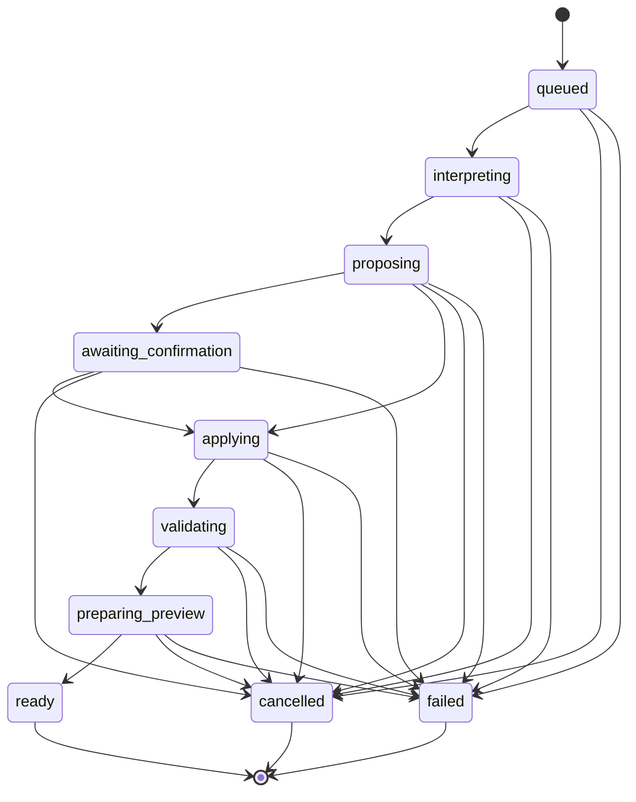

# AppBuilder Builder Workspace, Conversational Modification, and Version History (M08)

Milestone 8 of 12 in [#29](../../issues/29). Depends on M07 ([#36](../../issues/36),
implemented in [#48](../../pull/48)). Replaces the M05 "continuation page"
disclaimer at `/apps/[appId]` with the real builder workspace: a persisted
conversational editing surface built entirely on M04's controlled operation
engine and M06's preview runtime — never a parallel AI execution path, never
arbitrary source editing.

## Core principle

Every specification change — conversational or explicit (restore/undo) —
flows through the same M04-controlled path M07 already established:
**propose → validate → diff/classify → confirm if required → apply through
`applyOperation`/`restoreVersion`/`undoLastOperation` → new immutable
version → M06 preview build**. The model never writes to the specification
directly, never supplies actor identity, never self-approves a destructive
change, and never claims success before a persisted version and preview
build actually exist.

## Layout and responsive model

`apps/appbuilder/app/apps/[appId]/workspace/WorkspaceShell.tsx` (client
component) owns the layout; `apps/appbuilder/app/apps/[appId]/page.tsx`
(Server Component) does the initial actor-scoped, leak-safe load and hands
off to it — identical `try { ... } catch (NotFoundError) notFound()` contract
the M05 page used, so an unrelated actor still gets the same 404 a
nonexistent app would.

Breakpoints (`workspace.module.css`) intentionally match
`tests/e2e/specs/responsive.spec.ts`'s own contract (mobile 390, tablet 768,
laptop 1024, desktop 1440):

- **Desktop (≥1024px)** — a real three-column CSS grid: structure | preview |
  right panel (conversation/history tabs).
- **Tablet (768–1023px)** — two visible columns (preview | right panel);
  structure becomes a togglable overlay drawer (`data-drawer-open`).
- **Mobile (<768px)** — one panel visible at a time, switched via a
  `role="tablist"` tab bar (`data-active-panel`); all four logical panels
  stay mounted, CSS attribute selectors control visibility so no panel state
  is lost when switching.

Panel switching is keyboard-accessible (real `<button role="tab">` elements,
`aria-selected`) and the preview/conversation/version-history affordances are
never hidden entirely on any breakpoint — only re-laid-out.

## Conversation persistence

New tables (migration `0005_appbuilder_m08_conversations_modification_jobs.sql`):

- **`conversations`** — one row per app (unique on `appId`); the single
  builder-workspace thread. Auto-created on first message, never before (a
  viewer opening an untouched app sees an empty state, not a side-effecting
  create).
- **`conversation_messages`** — every message, forever. `role`
  (user/assistant/system) and `messageType` (`user_request`, `ai_proposal`,
  `system_status`, `validation_result`, `applied_change`, `failure`) are
  separate axes: `messageType` is what the UI renders distinctly, `role` is
  who "said" it. `authorPrincipalId` is set only for `user_request` (the
  trusted session actor, never client-supplied); assistant/system messages
  carry no principal, only a `modificationJobId` link. `selectedContext`,
  `baseVersionNumber`, `diffSummary`, `impactClassification`,
  `confirmationState`, `resultingVersionNumber`, `resultingPreviewBuildId`,
  `failureCode`/`failureMessage` are all persisted per message, not
  recomputed client-side.

Deliberately **not** persisted per message: every transient job-status tick
(`interpreting`, `proposing`, …). Only meaningful milestones become a
message (proposal ready, applied, failed/validation-failed) — polling the
job's own status (see below) covers the "what's happening right now" need
without turning the conversation log into a spam of ephemeral ticks.

`lib/repositories/conversations.ts` is the only write path — `appendUserMessage`
(actor-gated, `app.requestModification`) and `appendSystemMessage` (called
only from the modification pipeline, worker-side). Reads
(`getConversationForActor`, `listMessagesForActor`) are `app.viewConversation`
(viewer-rank) so a read-only user still sees full history.

**This is what survives refresh, sign-out/sign-in, a device switch, and a
worker restart**: the client never trusts its own in-memory state as
authoritative — `ConversationPanel.tsx` re-fetches `GET
/api/apps/{appId}/conversation` on every mount.

## Modification job lifecycle (`lib/modification/`)

A **sibling** of M07's `generation_jobs`/`generationOperationBatches`, not a
repurposing of it — see the `modificationJobs`/`modificationOperationBatches`
doc comments in `lib/db/schema.ts` for the full rationale (different FK
shape, different phase vocabulary, and a status M07 jobs never have:
`awaiting_confirmation`).

### State machine (`lib/modification/stateMachine.ts`)



### Pipeline phases (`lib/modification/pipeline.ts`)

1. **`interpreting`** — calls `AiProvider.proposeModification()` (a new
   method on the M07 `AiProvider` interface, `packages/appbuilder-ai`) with
   the user's request, the current specification, and any bounded selection
   context. A `clarificationNeeded: true` response fails the job safely
   (`invalid_request`) with the model's own bounded explanation — M08
   deliberately does not build a second multi-round clarification state
   machine; the user just sends a more specific follow-up message.
2. **`proposing`** — a **pure dry run**: chains every proposed operation
   through `@asafarim/appbuilder-schema`'s `applySpecOperation` (never the
   DB-backed `applyOperation`) to compute the full resulting spec, the
   structured diff (`diffSpecifications`), and which operations the pure
   engine classifies as destructive — all before anything is persisted. The
   proposal batch and diff are recorded (`modification_operation_batches`,
   an `ai_proposal` conversation message) either way. If nothing is
   destructive, moves straight to `applying`. If something is, moves to
   `awaiting_confirmation` with a bound confirmation token (see below) and
   applies nothing yet.
3. **`applying`** — the **only** phase that calls the real, capability-checked,
   optimistically-concurrent `applyOperation` (M04) — once, for every
   non-rejected operation in the original proposal, in order, with
   `confirmDestructive` set per-operation from what was actually reviewed
   (and, if it was destructive, confirmed). If reality (re-validated against
   the *current* spec) disagrees with what the dry run showed, the whole job
   fails safely rather than silently dropping part of a reviewed proposal.
4. **`validating`** — defense-in-depth re-validation of the whole resulting
   spec (mirrors M07).
5. **`preparing_preview`** — calls M06's `requestPreviewBuild`; only
   transitions to `ready` if the build actually succeeded. The `applied_change`
   message (and any UI "success" state) is stamped only here, from what M04/
   M06 actually persisted — never from the model's own claim.

### Trusted actor model

Identical to M07: `initiatedByPrincipalId` is captured once at enqueue from
the authenticated session and replayed with `roles: []` for every
M04/M06 call, so access is re-derived live on every step — if the initiator
loses access before the job runs, it fails closed (`ForbiddenError`/`NotFoundError`)
without mutating anything.

## Selection-context protocol

A user may select a rendered page/component in the live preview before
asking for a change (`"Make this table more compact"`). The payload crossing
the iframe boundary is **only** stable specification identifiers:

```ts
{ appId, specificationVersionNumber, pageId?, componentId?, componentKind?, label?, registryMetadata? }
```

— never raw DOM/HTML, CSS selectors, cookies, tokens, full record data, or
unbounded text (`lib/modification/selectionContext.ts`'s `SelectionContext`
zod schema enforces this shape and size bounds).

**Iframe side** (`app/apps/[appId]/preview/[[...path]]/PreviewSelectionBridge.tsx`,
active only when the preview route is loaded with `?embed=workspace&nonce=...`
— the standalone `/apps/{appId}/preview` route is completely unaffected):
listens for a `message` matching its own query-string nonce from
`window.parent` only, then on click walks up to the nearest
`[data-ab-component-id]` ancestor (a new attribute
`@asafarim/appbuilder-runtime`'s `renderPreview.tsx` now stamps on every
rendered component wrapper) and posts `{type:"ab-preview-select", nonce, appId,
specificationVersionNumber, buildId, pageId, componentId, componentKind, label}`
back to `window.parent`, targeted at `window.location.origin` — never `"*"`.

**Parent side** (`app/apps/[appId]/workspace/PreviewPane.tsx`, decision logic
factored into the pure, unit-tested `previewProtocol.ts`): generates a fresh
nonce per mount (and per version change — the iframe remounts on a `key`),
validates `event.origin === window.location.origin` and `event.source ===
iframe.contentWindow` **before** even parsing the payload, only recognizes
two message types (`ab-preview-ready`, `ab-preview-select`), and rejects a
selection whose `appId` doesn't match or whose
`specificationVersionNumber` no longer matches the app's current version
(stale selection — the user must reselect in the fresh preview). Actor
identity is never accepted from the iframe in either direction.

Server-side, `validateSelectionContext` (called from the "send message" API
route) independently re-verifies the selection against the app's actual
current specification — a forged or stale `pageId`/`componentId` is rejected
(`InvalidSelectionError`/`StaleSelectionError`, 404/409) regardless of what
the client claimed.

## Confirmation policy

Folded directly onto `modification_jobs` (no separate table — a job has
exactly one confirmation cycle for its one proposed batch):
`confirmationRequired`, `confirmationChecksum`, `confirmationBaseVersionNumber`,
`confirmationExpiresAt`, `confirmationConfirmedAt`, `confirmationConfirmedByPrincipalId`.

A confirmation (`POST /api/apps/{appId}/modification-jobs/{jobId}/confirm`,
`lib/repositories/modificationJobs.ts#confirmModification`) is valid only if
**all** of these hold:

- the confirming actor **is** `job.initiatedByPrincipalId` (only the person
  who asked can confirm — never a different collaborator, never the model);
- the confirmation hasn't expired (`CONFIRMATION_TTL_MS`, 15 minutes);
- the client's checksum matches `computeProposalChecksum()` of the exact
  destructive operations shown — not just "yes, apply the batch";
- the specification's *current* version still matches
  `confirmationBaseVersionNumber` — a concurrent edit invalidates the
  confirmation rather than being silently applied against a version the
  human never reviewed.

Expired/stale-version confirmations fail the job (`confirmation_expired` /
`stale_base_version`) rather than silently retrying. An already-confirmed
job replays idempotently for the same checksum (safe for a double-click);
a *different* checksum on an already-confirmed job is rejected. The whole
decision runs inside one transaction that never throws — it returns a
discriminated result and only throws afterward — because `db.transaction()`
rolls back everything on a thrown error, which would otherwise silently undo
the very "mark this job failed" write the expired/stale paths depend on.

## Version history and restore/undo

`app/apps/[appId]/workspace/VersionHistoryPanel.tsx` +
`GET/POST /api/apps/{appId}/specification/versions*` wrap M04's existing
`listVersionsForActor`/`getVersionForActor`/`compareVersionsForActor`/
`restoreVersion`/`undoLastOperation` — no new mutation logic, only a UI and
route surface M04 never had before M08.

- **Restore-as-new-version** is **owner-only** (`app.restoreVersion`,
  distinct from `app.editSpecification`/`app.applyOperation`, which stay
  editor-rank) — the issue's builder-workspace policy explicitly separates
  "owner: full M08 editing and restoration capability" from "editor:
  conversational/specification editing." Restoring always creates a new
  version and a fresh preview build; the target version being restored from
  is never mutated.
- **Undo** (editor-rank) computes a safe inverse via M04's `invertOperation`;
  when none exists (e.g. undoing an archive), it returns
  `RestoreRequiredError` (409, `code: "restore_required"`) and the UI offers
  "restore an earlier version" instead of guessing.

## Concurrency and stale edits

Every mutating path (`applyOperation`, `restoreVersion`, `undoLastOperation`,
and now `confirmModification`'s version check) uses M04's existing
row-locked, `baseVersionNumber`-compared optimistic concurrency
(`StaleVersionError`). M08 adds nothing new here except applying the same
discipline to the confirmation step itself: if the spec changed while a
destructive proposal awaited a human decision, confirming it fails safely
(never silently rebased, never overwrites the newer edit) and the original
conversation/proposal is preserved for audit.

## Polling and reconnection

`ConversationPanel.tsx` polls `GET /api/apps/{appId}/modification-jobs`
(latest job, any status) every 3s while non-terminal — identical idiom to
M07's `GenerationStatusPanel`. On mount (refresh, tab reopen, device switch),
it always re-fetches conversation + latest job fresh rather than trusting
any prior in-memory state, so reconnection is just "the normal initial
load," not a special code path. Polling is inherently actor/app-scoped (the
session cookie), stops the moment the job reaches a terminal status, and
never double-applies anything (idempotency keys throughout).

## Draft, preview, and production separation

The top bar shows the current draft version, preview status, and an explicit
**disabled** "Deploy" control with a tooltip explaining deployment isn't
available until M11 — M08 never wires conversational or restore/undo
mutations to any release/production pointer. `specifications.pinnedPreviewBuildId`
(M06) remains the only "is there a working preview" signal, untouched by
this milestone's own concerns beyond what M04/M06 already guarantee (a
failed rebuild never clears a previously-successful pin).

## Authorization (`lib/repositories/authz.ts`)

New M08 capabilities, all following the existing `assertCapability` chokepoint
and leak-safe (`NotFoundError` for unrelated actors, never a distinguishing
403):

| Capability | Min role |
| --- | --- |
| `app.viewConversation` | viewer |
| `app.requestModification` | editor |
| `app.cancelModification` | editor |
| `app.confirmModification` | editor (further bound to the job's own initiator — see above) |
| `app.undoOperation` | editor |
| `app.restoreVersion` | owner |

`app.viewConversation` stays allowed on an archived app (matching
`app.viewGenerationJob`); every mutation capability above is blocked while
archived, same as `app.editSpecification`.

## Safe conversation rendering

`app/apps/[appId]/workspace/SafeMarkdown.tsx` renders a strict allowlisted
subset — **bold**, *italic*, `code`, and `- ` bullet lists only — as real
React elements with plain-string children. No links, no images, no raw HTML
passthrough, and `dangerouslySetInnerHTML` is never used anywhere in this
milestone. A `<script>` tag or an `onerror=`-style injection attempt in a
message is rendered as inert, escaped text (see `SafeMarkdown.test.tsx`).

## Testing

- **Unit** (`vitest`, no DB): `previewProtocol.test.ts` (origin/source/nonce/
  app/version gating), `SafeMarkdown.test.tsx` (safe rendering, XSS
  resistance — `renderToStaticMarkup`, no jsdom needed), `confirmation.test.ts`,
  `stateMachine.test.ts`, `selectionContext.test.ts`, plus
  `@asafarim/appbuilder-ai`'s `modificationProposal.test.ts`.
- **Integration** (real Postgres, `vitest.integration.config.ts`):
  `lib/repositories/conversations.integration.test.ts`,
  `lib/repositories/modificationJobs.integration.test.ts`, and
  `lib/modification/pipeline.integration.test.ts` (golden path,
  selection-scoped changes, ambiguous-request failure, destructive
  confirmation — success/forged/expired/wrong-actor/idempotent-replay,
  concurrent-edit staleness, cancellation, worker crash recovery,
  cross-owner isolation).
- **Playwright** (`tests/e2e/specs/builder-workspace.spec.ts` +
  `builder-workspace-accessibility.spec.ts`), against the real worker
  forced onto the deterministic fake provider (see
  `packages/appbuilder-ai/src/fixtures/modification.ts` — a new seeded
  "Builder Workspace Demo" app in `global-setup.ts` whose `task`/`tasks`/
  `tasks_table`/`employee_role` ids match those fixtures exactly, since the
  M04 construction fixture already ships a `priority` field): three-panel
  desktop rendering, conversational priority-add end to end, selection-scoped
  compact-table change, destructive confirmation, version history compare/
  restore, viewer read-only, unrelated-user isolation, refresh reconnection,
  adversarial markdown safety, and mobile/tablet responsive layouts. No test
  in this suite makes a real AI provider call.

## Explicit deferrals

- **M09** (generated-record data engine, RBAC execution): the structure
  panel is read-only navigation over the persisted spec; it implies no data
  CRUD and no runtime permission enforcement.
- **M10** (validation/approval gates): `app.validate`/`app.approve` remain
  defined but uncalled.
- **M11** (real deployment, custom domains): the top bar's "Deploy" control
  is deliberately disabled and explanatory only.
- Not implemented, per the issue: arbitrary/Monaco source editing,
  generated-record CRUD, generated-app permission enforcement, an automated
  QA/repair loop, production deployment, real-time multiplayer cursors,
  billing, code export.
