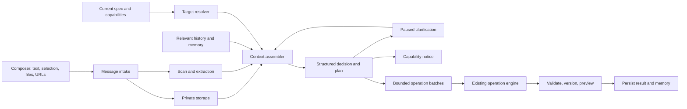

# M13 — Multimodal, Context-Aware AppBuilder Assistant

M13 turns the M08 conversation panel from a one-shot specification command
box into a grounded builder assistant. It adds image/file attachments,
conversation memory, deterministic target resolution, assumption-first
planning, useful clarification, and multi-step plans for larger requests.

This milestone is based on the reported post-M12 conversation. The assistant
rejected “replace the title Home to Experiences” and “change the title color
to blue,” continued asking for details after receiving a DOM selector and
page-level scope, and rejected a detailed landing-page brief as “too broad.”

## Root causes

1. **No evidence channel.** `ConversationPanel.tsx` sends text and an optional
   preview selection, but no screenshots, images, documents, or references.
2. **No conversational context.** Prior turns are persisted for display, but
   `proposeModification` gets only the latest message, current spec, and
   optional selection.
3. **Clarification is a failure.** `pipeline.ts` converts
   `clarificationNeeded=true` into a failed `invalid_request` job. A follow-up
   becomes an unrelated request.
4. **One-shot planning.** A job may propose one bounded batch, so large valid
   work is confused with ambiguous work.
5. **Capability mismatch.** The allowlisted specification cannot express
   arbitrary HTML/CSS, Framer Motion, GitHub ingestion, or every visual detail.
   This is reported as a user-request problem instead of a product limit.
6. **Weak target resolution.** “The title whose value is Home” is not first
   resolved against an indexed view of the current specification.
7. **Misleading fake fallback.** The default modification fixture intentionally
   returns the exact “too broad” failure seen in the transcript.

## Product contract

The assistant follows this decision order:

1. Resolve the target from a current preview selection.
2. Otherwise resolve it from stable IDs, exact visible text, page/path,
   component metadata, current values, and recent accepted references.
3. If one high-confidence target remains, act and state the assumption.
4. If several changes are required, show a plan and execute independently
   validated batches.
5. If the result cannot be represented by the schema/registry, explain the
   capability gap and offer the closest supported alternative.
6. Ask one concise question only when two or more materially different, safe,
   representable outcomes remain.

“Broad” alone is never a rejection reason. Reversible presentation defaults
such as mapping “blue” to the current palette use a visible assumption.
Consequential ambiguity involving permissions, data loss, publication, or
destructive changes still requires confirmation.

## Scope

### In scope

- PNG, JPEG, WebP, non-animated GIF, text, Markdown, JSON, CSV, and PDF.
- Picker, paste, drag/drop, preview, removal, progress, retry, and history.
- Private storage, MIME sniffing, ownership, extraction, thumbnails,
  malware/quarantine hook, quotas, retention, and deletion.
- Multimodal image input and bounded extracted document text.
- Relevant recent turns plus durable structured memory.
- Deterministic specification indexing and target resolution.
- Structured `ready`, `needs_clarification`, `partially_supported`, and
  `unsupported` outcomes.
- Multi-batch plans that reuse the controlled operation engine.
- Explicit, SSRF-safe public URL import, including public GitHub metadata.
- Observability, privacy, accessibility, and quality evaluation.

### Out of scope

- Arbitrary source-code editing inside deployed apps.
- Executing scripts, macros, binaries, archives, or attached code.
- Autonomous third-party login or private GitHub access without a separately
  authorized integration.
- Unrestricted model tools replacing the operation engine.
- Audio/video understanding.
- A vector database unless evaluation proves bounded structured memory and
  attachment chunks insufficient.

## User experience

### Composer

Replace the textarea/send row with:

- an accessible “Add files or images” action;
- paste and drag/drop targets;
- chips with thumbnail/icon, name, size, state, retry, and remove;
- the preview selection as a first-class context chip;
- multiline input (Enter sends; Shift+Enter adds a newline);
- send enabled when text or at least one ready attachment exists;
- precise type/size/count/scan/expiry errors;
- preserved draft/upload state across workspace panel switches;
- a mobile layout without horizontal overflow.

Initial server-owned limits:

| Limit | Default |
|---|---:|
| Attachments per message | 8 |
| Image size | 10 MB each |
| Text/Markdown/JSON/CSV | 2 MB each |
| PDF | 20 MB each |
| Extracted text | 50,000 characters per file |
| Extracted text per model call | 100,000 characters total |
| Image dimensions | 12,000 × 12,000 maximum, then downsample |

The server returns this catalogue; the client keeps no divergent allowlist.

### Conversation cards

- **Plan** — numbered steps, current step, and supported scope.
- **Assumption** — e.g. “I matched ‘Home’ to the only page title with that
  value.”
- **Clarification** — one question with grounded choices and optional text.
- **Capability notice** — unsupported item, reason, and alternatives.
- **Attachment** — persisted thumbnail/metadata and processing status.

Clarification pauses a job rather than failing it. The answer resumes the same
intent with the original request, attachments, candidates, and prior answers.
Thus “at the page level” completes the pending question instead of starting a
new request.

### Large requests

For the supplied landing-page brief, the assistant:

1. compares requested features with the active capability catalogue;
2. labels supported, partially supported, and unsupported items;
3. proposes stages such as structure, content, branding, integration, and QA;
4. applies safe stages sequentially;
5. creates an immutable version and validation evidence for each batch;
6. stops with a recoverable partial result if a later stage fails;
7. calls out unsupported arbitrary animation/code honestly.

## Architecture



## Data model

### `conversation_attachments`

- IDs for attachment, app, conversation, nullable message, and trusted uploader
- original filename, declared/detected MIME, bytes, and SHA-256
- private storage key and optional thumbnail key
- `pending | uploaded | processing | ready | quarantined | failed | deleted`
- extraction kind/version, bounded text, page count, dimensions
- safe failure code/message and lifecycle timestamps

An attachment is initiated before message creation and atomically claimed by
exactly one message at send time. Ownership and app scope are rechecked.
Unclaimed uploads expire; claimed attachments follow conversation retention.

### `conversation_memories`

One versioned, bounded, structured row per conversation:

- resolved references (`"the Home title"` to stable target/property);
- accepted assumptions and app-relevant preferences;
- recent plan, applied version, and unresolved clarification;
- source message IDs and specification version for every fact.

Memory is evidence-linked, correctable, and invalidated when targets disappear
or the specification becomes stale. It is not an opaque prose summary.

### `modification_plans` and `modification_plan_steps`

A plan owns the triggering message, capability assessment, status, base
version, and summary. Each step owns one bounded operation batch and is
`pending | running | awaiting_confirmation | applied | failed | skipped`.
Existing modification jobs reference steps or are migrated into the model;
M13 must not create a second mutation executor.

### Clarification state

Add `needs_clarification` and persist:

- stable question ID and concise question;
- two to five answers with stable targets where possible;
- whether free text is allowed;
- round, expiry, answer, and answering principal;
- exact context/spec version that produced the question.

Allow at most two rounds per plan. Then choose a safe supported default with a
visible assumption, offer a no-op, or return a capability notice.

## APIs

- `POST /api/apps/{appId}/conversation/attachments/init`
- local `PUT .../attachments/{id}/content`, or private presigned production
  upload
- `POST .../attachments/{id}/commit`
- `GET/DELETE .../attachments/{id}`
- Extend `POST /conversation/messages` with `attachmentIds[]`, claimed
  transactionally with message/job creation.
- `POST /modification-jobs/{jobId}/clarification` persists an answer and
  resumes idempotently.
- Optional `POST /conversation/references/import` imports a bounded public
  HTTPS resource with provenance.

Every mutation is actor/app scoped, idempotent, bounded, quota-checked, and
uses indistinguishable not-found behavior for cross-owner access. Raw storage
keys are never returned.

## Attachment processing

Processing runs outside the request:

1. Detect MIME from bytes; never trust extension/browser MIME.
2. Reject polyglots, encrypted PDFs, archives, active content, and unsupported
   formats.
3. Scan through an adapter. Production requires a real scanner; development
   may explicitly report `not_configured`.
4. Strip image metadata, normalize orientation, and create safe thumbnails.
5. Extract bounded text with page/row provenance.
6. Treat all extracted content as untrusted prompt data.
7. Never log content, image bytes, signed URLs, or storage keys.

## Context and target resolution

`buildModificationContext` becomes the only provider-input builder. It takes
the latest request, current server-loaded spec/version, validated selection,
relevant turns, answers, memory, attachment inputs/chunks, target candidates,
capability catalogue, and operation budget.

It returns a manifest of included source IDs, omitted/truncated sources, token
estimate, and redaction flags. Persist a safe manifest summary, not raw prompts.

Index:

- page IDs, names, paths, titles, and navigation labels;
- component IDs, kinds, labels, ownership, and bound entities;
- entity/field IDs, names, machine names, values, and config;
- branding properties and current values.

Resolve in this order: current selection, stable ID, exact property match,
exact label, unique case-insensitive match, recent memory, then model ranking
of bounded candidates. Auto-resolve only one candidate above a calibrated
threshold with sufficient margin; otherwise ask one candidate-based question.

DOM selectors are evidence only. The preview bridge maps them to current stable
page/component/property IDs. Selectors never become mutation authority. If a
node is builder chrome rather than spec-editable content, return a capability
notice instead of more clarification.

## Intent and capability contract

Replace `clarificationNeeded: boolean` with:

```ts
type ModificationDecision =
  | { outcome: "ready"; intent: ResolvedIntent; plan: PlannedStep[]; assumptions: Assumption[] }
  | { outcome: "needs_clarification"; question: ClarificationQuestion; candidates: TargetCandidate[] }
  | { outcome: "partially_supported"; plan: PlannedStep[]; unsupported: CapabilityGap[] }
  | { outcome: "unsupported"; unsupported: CapabilityGap[]; alternatives: SupportedAlternative[] };
```

`ResolvedIntent` records action, stable targets, values, scope, confidence,
and supporting source IDs. Operations cite their intent/source and remain
independently schema-validated and dry-run.

Generate the capability catalogue from the actual operation union, branding
schema, component/integration registries, and active flags:

- supported now;
- supported as a multi-step plan;
- partially supported;
- unsupported because schema/component/integration/code support is absent;
- temporarily unavailable because a supported dependency is unhealthy.

## Provider behavior

- Send image parts only to vision-capable models.
- Keep a text-only path and expose provider modalities in readiness.
- If vision is unavailable, disclose that the image was not analyzed while
  still using text/selection context.
- Prefer reversible assumptions for styling defaults; do not demand a hex
  value when “blue” can map to the app palette.
- Keep authorization, destructive confirmation, dry-run, versioning, and
  validation outside model control.
- Replace the generic fake refusal with scripts for target resolution,
  attachments, clarification/resume, partial support, plans, and capability
  notices.

## Delivery slices

### A — Evaluation baseline

- Redact/check in the reported conversation as a regression corpus.
- Label intent, target, capability class, allowed response, and question need.
- Score target accuracy, operation validity, clarification precision, plan
  completion, and capability truthfulness.
- Record the current baseline before prompt changes.

**Exit:** reproducible fake-provider CI and optional real-provider evaluation.

### B — Secure attachment foundation

- Add migration, repositories, upload APIs, storage keys, worker extraction,
  auth, quotas, retention, and cleanup.
- Reuse `@asafarim/storage`, but not generated-record upload tables because
  authorization and lifecycle differ.

**Exit:** owner/editor upload succeeds; viewer, cross-app, spoof, oversize, and
duplicate commit fail; private access and expiry are verified.

### C — Composer and history

- Implement picker, paste, drop, progress, retry/remove, thumbnails, and
  persisted cards.
- Cover keyboard, screen reader, reduced motion, mobile, and failures.

**Exit:** a pasted screenshot survives send, refresh, and another session;
accessibility/mobile Playwright tests pass.

### D — Grounded context and resolution

- Build spec index, resolver, context assembler, memory, and manifest.
- Map preview interactions to stable editable targets/properties.
- Supply relevant history and attachment evidence.

**Exit:** selected “title to blue,” unique “value is Home,” and “still black”
work; duplicate/stale matches yield one grounded question.

### E — Clarification and planning

- Add paused clarification API/UI/state.
- Add decisions, assumptions, capability gaps, and multi-step plans.
- Execute steps through existing jobs and safety gates.

**Exit:** “page level” resumes the original intent; a landing-page brief
becomes a plan plus honest gaps; clarification is never a failure.

### F — Public references and GitHub

- Add SSRF-safe import with timeouts, size/type bounds, redirect limits,
  provenance, caching, and policy review.
- Use GitHub’s public API for profile/repository metadata.
- Stamp source URL/fetch time; never call unavailable or stale data “live.”

**Exit:** public GitHub data can ground content; private/link-local/oversize
targets fail; imported prompt injection cannot become instructions/tools.

### G — Hardening and rollout

- Add events, correlation IDs, dashboards, cost/token/storage metrics, cleanup,
  threat model, privacy/runbooks, and independent feature flags.
- Dark-launch context/decision generation without applying shadow proposals.
- Roll out internal, small cohort, then general availability after gates pass.

**Exit:** no critical/high finding; each feature can be disabled without making
history unreadable; deletion/export are complete.

## Acceptance scenarios

| Input | Required behavior |
|---|---|
| Detailed AI-engineer landing-page brief | Staged plan, capability assessment, supported execution; never only “too broad.” |
| “replace the title Home to Experiences” | Resolve unique page/title/navigation match and state assumption; ask only for real duplicates. |
| “change the title color to blue” | Use selection/recent target and palette/default blue; exact hex is optional. |
| “the title that its value is Home” | Search exact values while retaining the original requested action. |
| Selector plus “still black” | Map evidence to a stable target and retain blue; otherwise identify builder chrome as unsupported. |
| “page/component style” then “at page level” | Treat both as answers within one pending intent and resume. |
| Screenshot plus “make this blue” | Use image/selection and state target; if vision is off, disclose that and use remaining context. |

## Quality and safety gates

Required tests:

- unit/schema: decisions, context truncation, resolver ranking, memory
  invalidation, capability classes, plan transitions;
- integration: attachment lifecycle/idempotency/auth/retention, clarification
  resume, stale versions, partial plan failure, destructive confirmation;
- adversarial: prompt injection, MIME spoof, decompression bomb, malicious
  filename, SVG/HTML active content, cross-app IDs, SSRF, redirects, secrets;
- provider: vision available/unavailable and malformed multimodal output;
- Playwright: picker/paste/drop, progress/retry, refresh, mobile, accessibility,
  clarification choices, and plan progress.

Initial release targets:

| Metric | Target |
|---|---:|
| Unique exact target resolution | ≥ 98% |
| Unnecessary clarification on actionable regression cases | ≤ 5% |
| Necessary clarification precision | ≥ 95% |
| Schema-valid operations | ≥ 99% |
| Capability classification accuracy | ≥ 95% |
| Successful cross-app attachment access | 0 |
| Destructive apply without confirmation | 0 |
| Cleanup within retention window | ≥ 99.9% |

Real-provider semantic evaluation is a release gate, not deterministic
per-commit CI. Routine telemetry stores redacted scores/case IDs, not prompts
or attachment content.

## Observability, privacy, and quotas

Measure attachment processing/cleanup, bytes, text/image model usage, included
and truncated context, resolver confidence, decisions, clarification rounds,
capability gaps, plan failures, corrections, provider errors, and vision
readiness.

Readiness reports storage, extraction worker, scanner, provider modalities,
URL import, cleanup lag, and evaluation version. Unconfigured dependencies
must not report healthy.

- Unclaimed uploads: delete within 24 hours.
- Claimed files/text/thumbnails: retain with conversation; include in app
  deletion/export.
- Delete memory when source messages are deleted.
- Keep public-reference provenance and a documented cache TTL.
- Provide owner-visible attachment deletion and audit evidence.
- Document provider retention before production multimodal enablement.

Add per-message/app/owner limits for attachment bytes/count, extracted tokens,
image calls, public fetches, and plan steps to the M12 quota/usage ledger.

## Definition of done

M13 is done only when:

- attachments work end to end in the composer and persisted history;
- images/documents reach a capable provider through bounded safe context;
- prior answers and resolved references affect subsequent interpretation;
- clarification is resumable and is not represented as failure;
- the reported Home/title/blue sequence passes the regression corpus;
- large representable work runs as a visible bounded plan;
- unsupported requests receive truthful gaps and alternatives;
- M04/M08/M10 mutation safety invariants remain intact;
- quotas, retention, observability, threat model, runbooks, accessibility, and
  responsive behavior are documented and tested;
- release quality targets are met.

## Implementation order and estimate

Deliver seven reviewable pull requests matching slices A–G. A reasonable
estimate for one experienced engineer is 8–12 weeks, mainly dependent on
malware-scanner and GitHub-reference choices. Slices A–E deliver the core
assistant improvement; public URL/GitHub import may remain feature-flagged
without blocking attachment and contextual-assistant release.
