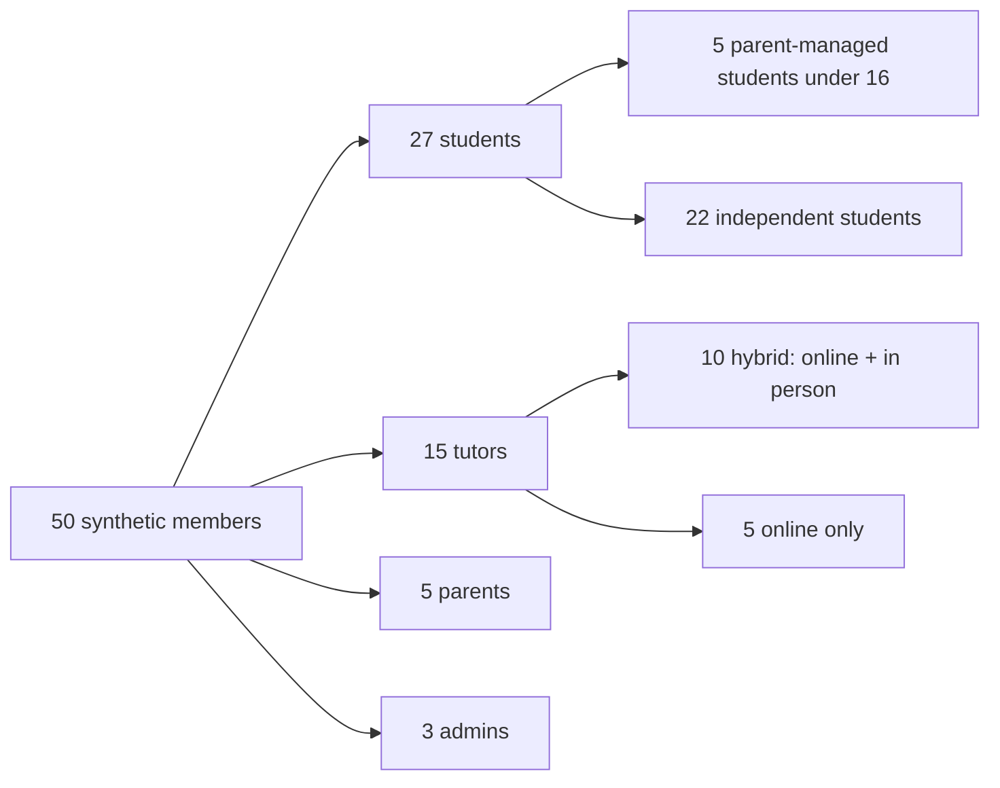
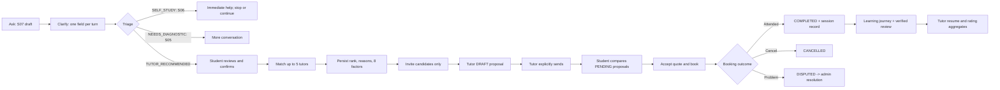
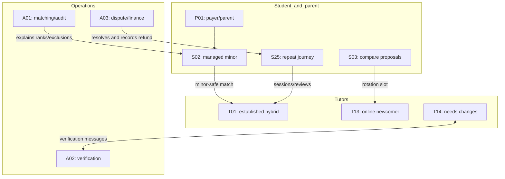

# EduMatch presentation seeding scenarios

Status: implemented by the EduMatch seed definition version 2.1.0. The roster,
foreground stories, and data-coherence rules below are the presentation seed's
source of truth; no application behavior is changed by the seed.

## 1. Goal and current-product scope

Create a deterministic, synthetic EduMatch universe that can be opened and
presented without first manufacturing data by hand. It should demonstrate the
current product promise:

> Ask -> understand -> clarify -> help now -> build a Learning Brief -> match
> tutors -> compare prepared proposals -> book -> learn -> track progress.

The universe also needs meaningful parent, tutor, trust-and-safety, finance,
notification, and admin states. Definition version 2.1.0 expands the original
3-student, 3-tutor seed to 50 members and deliberately covers the features
added through the 2026-08-12 repository state, including
Learning Briefs, fair tutor rotation, parent-managed minors, age-aware avatars,
multi-aspect reviews, tutor resumes, verification conversations, disputes, and
admin diagnostics.

## 2. Demo-data rules

| Rule                | Proposed convention                                                                                  | Why it matters                                                                                                     |
| ------------------- | ---------------------------------------------------------------------------------------------------- | ------------------------------------------------------------------------------------------------------------------ |
| Synthetic ownership | Exact allowlisted `asafarim+edu…@gmail.com` aliases and `seed-edumatch-` identifiers                 | Seeded rows remain removable without claiming ownership of other Gmail users.                                      |
| Shared demo login   | Hash `EDUMATCH_SEED_USERS_PASSWORD` with bcrypt for every member                                     | Every student, tutor, parent, and admin can be presented through real credentials without committing the password. |
| Time                | Define `T0` as the seed execution time; express dates as `T0 +/- duration`                           | Future bookings remain future and payout/dispute windows remain demonstrable.                                      |
| Repeatability       | Upsert by fixed user email and fixed scenario key                                                    | Re-running the seed produces the same universe.                                                                    |
| No external effects | No real email, AI, Stripe charge, payout, or storage action                                          | A presentation cannot contact or charge anyone.                                                                    |
| Honest aggregates   | Derive tutor ratings from seeded reviews and resume facts from completed sessions                    | Public trust signals agree with the underlying history.                                                            |
| Privacy             | Synthetic names, locations, messages, files, guardian details, and reviews only                      | The dataset is safe to share on screen.                                                                            |
| Presentation access | Use the existing approved non-production shared-auth fixture; never store passwords in this document | Demo identities must be reachable without adding secrets to Git.                                                   |

## 3. Population: exactly 50 members

| Member type |  Count | Designed variation                                                                                                                                             |
| ----------- | -----: | -------------------------------------------------------------------------------------------------------------------------------------------------------------- |
| Students    |     27 | K12/undergraduate/graduate; under 13, parent-managed under 16, independent 16+; five languages; online, in-person, or either; empty through completed journeys |
| Tutors      |     15 | Exactly 10 hybrid and 5 online-only; verified and unverified states; minor clearance; newcomers and established tutors; Connect and wallet states              |
| Parents     |      5 | Multi-child, single-child, and empty dashboards                                                                                                                |
| Admins      |      3 | Operations overview, verification/safeguarding, and support/finance perspectives                                                                               |
| **Total**   | **50** |                                                                                                                                                                |

## 4. Member roster

### 4.1 Tutors (15)

The `Mode` column deliberately satisfies the requested split: T01-T10 are
hybrid; T11-T15 are online-only.

| ID  | Synthetic name    | Mode        | Subjects and levels                   | Languages  | Trust state              | Rating history           | Finance/demo distinction                           |
| --- | ----------------- | ----------- | ------------------------------------- | ---------- | ------------------------ | ------------------------ | -------------------------------------------------- |
| T01 | Amira Vandenberg  | Hybrid      | Mathematics, Physics; K12/UG          | nl, en     | Verified; minors cleared | 4.8 / 12; aspect ratings | Connect enabled; EUR 128.50 available; rich resume |
| T02 | Lucas De Smet     | Hybrid      | Chemistry, Biology; K12               | nl, en     | Verified; minors cleared | 4.6 / 8                  | Connect enabled; pending funds                     |
| T03 | Sofia Martins     | Hybrid      | Computer Science, Statistics; UG/GRAD | en, fr     | Verified                 | 4.7 / 6                  | Connect enabled; recent payout                     |
| T04 | Julien Lambert    | Hybrid      | French, English; K12/UG               | fr, en     | Verified; minors cleared | 4.5 / 4                  | Connect not started                                |
| T05 | Aisha El Mansouri | Hybrid      | English, Study Skills; K12/UG         | fr, en, nl | Verified; minors cleared | 4.9 / 3                  | Connect enabled; below payout threshold            |
| T06 | Bram Peeters      | Hybrid      | Economics, Accounting; UG             | nl, en     | Verified                 | 4.0 / 2; shown as new    | Connect refresh required                           |
| T07 | Lea Weber         | Hybrid      | German, History; K12/UG               | de, fr, en | Verified; minors cleared | 5.0 / 1; shown as new    | No Connect account                                 |
| T08 | Noa Janssen       | Hybrid      | Mathematics, Computer Science; K12/UG | nl, en     | Verified                 | No reviews; newcomer     | Fair-rotation candidate; no wallet activity        |
| T09 | Elena Rossi       | Hybrid      | Art, Design; K12/UG                   | fr, en     | Verification pending     | No reviews               | Submitted checklist and documents                  |
| T10 | Tom Becker        | Hybrid      | Biology, Chemistry; K12               | de, en     | Verification pending     | No reviews               | Profile complete; waiting for admin                |
| T11 | Priya Nair        | Online only | Mathematics, Physics; K12/UG          | en, nl     | Verified; minors cleared | 4.9 / 10                 | Connect enabled; payout eligible                   |
| T12 | Marcus Okafor     | Online only | Chemistry, Biology; K12               | en, fr     | Verified; minors cleared | 4.4 / 5                  | Connect enabled; zero balance                      |
| T13 | Sofia Chen        | Online only | Computer Science, Statistics; UG/GRAD | en, de     | Verified                 | No reviews; newcomer     | Fair-rotation candidate; notification opt-outs     |
| T14 | Nadia Haddad      | Online only | English, Study Skills; K12/UG         | fr, en     | Needs changes            | No reviews               | Verification thread with attachment and reactions  |
| T15 | Viktor Klein      | Online only | Economics, Accounting; UG/GRAD        | de, en     | Rejected                 | No reviews               | Historical rejection visible to admin              |

Tutor profile design notes:

- Rates should span EUR 28-70/hour without using price as a match factor.
- Hybrid tutors need synthetic Brussels/Luxembourg-region coordinates and
  service radii of 5-40 km; online-only tutors do not need proximity to match.
- T01, T02, T04, T05, T07, T11, and T12 are the minor-eligible pool.
- T08 and T13 prove that the fifth fair-rotation slot can include a qualified
  newcomer without lowering any hard filter.
- T09-T15 give every verification queue state: pending, needs changes,
  verified, rejected, plus two-way unread/read messages and an attachment.

### 4.2 Students (27)

| ID  | Synthetic name  | Age/level | Language and mode | Primary presentation state                                              |
| --- | --------------- | --------- | ----------------- | ----------------------------------------------------------------------- |
| S01 | Noor Vermeulen  | 20, UG    | nl, either        | Completed maths journey; attended record; aspect review                 |
| S02 | Mila Jacobs     | 14, K12   | nl, in person     | Parent-managed; matched only to cleared nearby tutors; scheduled lesson |
| S03 | Elias Bernard   | 18, K12   | fr, online        | Independent student; mixed proposal states and newcomer slot            |
| S04 | Leonie Dubois   | 12, K12   | fr, online        | Parent-managed; preset avatar; custom photo rejected by age rule        |
| S05 | Samir Rahman    | 15, K12   | en, either        | Parent-managed; dyslexia accommodation; `NEEDS_DIAGNOSTIC` brief        |
| S06 | Hannah Kruger   | 22, UG    | de, online        | `SELF_STUDY`; immediate help; deliberately no tutor invitation          |
| S07 | Yara Demir      | 26, GRAD  | en, either        | Incomplete multi-turn draft; next-question behavior                     |
| S08 | Mateo Silva     | 19, UG    | fr, online        | Legacy inquiry with completed AI response                               |
| S09 | Emma Vos        | 16, K12   | nl, either        | Independent at 16; proposal comparison and rating filter                |
| S10 | Idris El Amrani | 18, K12   | fr, in person     | Student-cancelled scheduled booking                                     |
| S11 | Clara Martin    | 21, UG    | fr, online        | Accepted quote and checkout/payment-pending presentation                |
| S12 | Finn Muller     | 24, GRAD  | en, online        | Completed lesson disputed within the 14-day window                      |
| S13 | Zoe Claes       | 13, K12   | nl, in person     | Parent-managed; custom avatar allowed; locality matching                |
| S14 | Adam Fischer    | 11, K12   | de, online        | Parent-managed; no-show dispute; default avatar                         |
| S15 | Ines Laurent    | 31, GRAD  | fr, either        | Archived brief and completed statistics journey                         |
| S16 | Ravi Patel      | 20, UG    | en, online        | Expired quote request and expired proposal                              |
| S17 | Nora Smit       | 18, UG    | nl, either        | Cancelled quote request; no booking                                     |
| S18 | Liam O'Connor   | 23, UG    | en, online        | Academic-integrity refusal and safe redirection                         |
| S19 | Sarah De Wilde  | 29, GRAD  | nl, either        | Hearing/caption accessibility need; confirmed but not shared brief      |
| S20 | Omar Haddad     | 34, UG    | en, online        | Legacy booked inquiry; quote PDF and booking confirmation               |
| S21 | Chloe Renard    | 18, K12   | fr, online        | Audio-file upload and transcription result; no live recording claim     |
| S22 | Daan Bakker     | 25, GRAD  | nl, online        | Image/screenshot attachment in conversational intake                    |
| S23 | Aya Schmidt     | 16, K12   | de, either        | New user onboarding and otherwise empty dashboard                       |
| S24 | Jonas Meyer     | 21, UG    | de, in person     | Complete profile but empty learning journey                             |
| S25 | Maya Johnson    | 28, GRAD  | en, online        | Repeat bookings, progress trend, homework, resources, concerns          |
| S26 | Theo Laurent    | 19, UG    | fr, in person     | No eligible tutor because all qualified tutors are outside radius       |
| S27 | Lina Peeters    | 17, K12   | nl, online        | Notification preferences, unread bell, and deep-linked tutor reply      |

Age design:

- Parent-managed under-16 students: S02, S04, S05, S13, and S14.
- Under-13 photo restriction examples: S04 and S14.
- S13 demonstrates the intentional distinction: age 13 allows a custom photo,
  while being under 16 still requires a parent-managed account.
- S09 and S23 demonstrate that students aged 16+ can act independently.

### 4.3 Parents (5)

| ID  | Synthetic name | Managed students | Dashboard state                  |
| --- | -------------- | ---------------- | -------------------------------- |
| P01 | Nadia Jacobs   | S02, S04         | Multi-child list                 |
| P02 | Marc Bernard   | None             | Empty state and Add child action |
| P03 | Fatima Rahman  | S05              | Single-child list                |
| P04 | Eva Claes      | S13              | Single child with custom avatar  |
| P05 | David Fischer  | S14              | Single child with default avatar |

### 4.4 Admins (3)

| ID  | Synthetic name  | Role emphasis                      | Main presentation surfaces                                     |
| --- | --------------- | ---------------------------------- | -------------------------------------------------------------- |
| A01 | Alex Morgan     | EduMatch operations admin          | Overview, users, bookings, inquiries, audit                    |
| A02 | Camille Janssen | Verification/safeguarding reviewer | Verification queue, checklist, tutor messages, minor clearance |
| A03 | Robin Schneider | Support/finance admin              | Disputes, refund records, transactions, wallets                |

## 5. Foreground scenario coverage matrix

These are the deliberately staged stories a reviewer should be able to open.
The listed records are the minimum state needed, not implementation guidance.

| Scenario | Area/state to demonstrate                                     | Spotlight actors             | Seeded proof visible in the app                                                                               |
| -------- | ------------------------------------------------------------- | ---------------------------- | ------------------------------------------------------------------------------------------------------------- |
| SC-01    | Public landing, theme, responsive navigation, locale selector | Signed out                   | Landing content; language options; dark/light-safe visuals                                                    |
| SC-02    | Signed-out Help Center                                        | Signed out                   | Student/tutor indexes, search result, empty search, related and previous/next guides                          |
| SC-03    | New independent student onboarding                            | S23                          | User with no profile activity; profile creation and empty dashboard                                           |
| SC-04    | Parent dashboard with multiple children                       | P01, S02, S04                | Two child cards with age-appropriate avatars                                                                  |
| SC-05    | Empty parent and Add child state                              | P02                          | Parent profile with no linked child                                                                           |
| SC-06    | Under-13 avatar restriction                                   | S04/S14                      | Preset/default avatar; no custom-photo storage key                                                            |
| SC-07    | Age 13-15 distinction                                         | S13                          | Custom avatar present but `parentUserId` still set                                                            |
| SC-08    | Conversational Learning Brief, one question at a time         | S07                          | DRAFT brief with ordered student/assistant turns and one next field                                           |
| SC-09    | Immediate help without tutor pressure                         | S06                          | `SELF_STUDY`, explanation, worked example, practice and study steps; no match candidates                      |
| SC-10    | Dedicated diagnostic not yet built                            | S05                          | `NEEDS_DIAGNOSTIC` in the conversational path; accessibility need retained                                    |
| SC-11    | Attachment intake                                             | S21, S22                     | One safe audio attachment/transcript and one safe image attachment                                            |
| SC-12    | Academic-integrity moderation                                 | S18                          | REFUSE outcome/category/reason, redirection response, and audit event; refused text absent from brief facts   |
| SC-13    | Student owns and edits the brief                              | S19                          | CONFIRMED brief with student correction; no quote request yet                                                 |
| SC-14    | Minor safeguarding hard filter                                | S02                          | Ineligible uncleared tutors excluded; only verified, cleared, subject/location-compatible candidates          |
| SC-15    | In-person proximity hard filter and no-match result           | S26                          | Zero eligible candidates plus admin diagnostic reasons by tutor                                               |
| SC-16    | Explainable ranking and fair newcomer rotation                | S03, T13                     | Five candidates, eight-factor breakdowns, reasons, rank, and one `rotationBoost=true` newcomer                |
| SC-17    | Invite-only boundary                                          | S03                          | Candidate-linked quote request; a non-candidate tutor has no quote and cannot see it on open marketplace      |
| SC-18    | Prepared proposal consent                                     | T03/T13                      | DRAFT proposals invisible to student; one adjusted draft; `sentAt=null` until explicit send                   |
| SC-19    | Proposal response variety                                     | S03                          | At least two PENDING proposals, one DRAFT, one tutor-declined proposal, and one unanswered invite             |
| SC-20    | Compare proposals and ratings                                 | S03/S09                      | Price, mode, language, start, plan, cancellation differences; rating/aspect data and newcomer treatment       |
| SC-21    | Legacy inquiry remains supported                              | S08                          | AI_RESPONDED legacy inquiry, AI metadata, and quote-request action                                            |
| SC-22    | Quote PDF and accepted quote                                  | S20, T11                     | Accepted quote, synthetic PDF URL/metadata, linked scheduled booking                                          |
| SC-23    | Checkout/payment-pending state                                | S11                          | Accepted quote, booking, payer ID, and no false paid indicator                                                |
| SC-24    | Parent is payer for managed child                             | P01/S02                      | Booking `studentId=S02` and `payerId=P01`; no claim of guardian approval UI                                   |
| SC-25    | Student cancellation                                          | S10                          | SCHEDULED -> CANCELLED, reason/timestamp, notifications and audit trail                                       |
| SC-26    | Completed trusted learning session                            | S01/T01                      | COMPLETED booking plus ATTENDED session record, topics, progress, homework, next step, resource               |
| SC-27    | Partial/no-show records                                       | S14 and one historical chain | PARTIAL and NO_SHOW examples, kept distinct from the North Star completion event                              |
| SC-28    | Repeat learning journey                                       | S25                          | Three chronological attended sessions with increasing progress and remaining concerns                         |
| SC-29    | Verified multi-aspect review                                  | S01/T01                      | One review per completed booking; clarity, reliability, engagement, weighted rating, anonymous public display |
| SC-30    | Dynamic tutor resume                                          | T01                          | Sessions, students, minutes, top topics, goal progress, current streak, recent reviews, earned milestones     |
| SC-31    | Rating filter and new-tutor label                             | T01/T06/T08                  | Established rating, sub-threshold rating shown as new, and zero-review newcomer                               |
| SC-32    | Open dispute and party response                               | S12/T03                      | DISPUTED booking, student reason, tutor response, unread notifications, audit events                          |
| SC-33    | Admin requests more dispute information                       | A03/S12                      | DISPUTED remains DISPUTED with `REQUEST_INFO` audit metadata                                                  |
| SC-34    | Refund-resolution record                                      | A03/S14                      | DISPUTED -> CANCELLED and negative REFUND ledger row; copy says refund recorded, not Stripe-processed         |
| SC-35    | No-refund resolution                                          | A03 and historical booking   | DISPUTED -> COMPLETED with resolution reason                                                                  |
| SC-36    | Tutor verification queue                                      | T09/T10/T14/T15/A02          | PENDING, NEEDS_CHANGES, REJECTED, and VERIFIED history rows; filters have non-empty results                   |
| SC-37    | Verification conversation                                     | T14/A02                      | Two-way thread, unread/read examples, safe attachment metadata, question/check reactions                      |
| SC-38    | Notifications and preferences                                 | S27/T13                      | Read/unread bell, mark-read state, deep-linked tutor reply, selected email/in-app opt-outs                    |
| SC-39    | Tutor Connect and wallet variants                             | T01/T02/T06/T11/T12          | Enabled, pending, refresh-required, payout-eligible, below threshold, zero-balance, and recent payout states  |
| SC-40    | Tutor dashboards                                              | T01/T08/T14                  | Busy established tutor, verified newcomer empty states, and unverified tutor call-to-action                   |
| SC-41    | Admin overview and directories                                | A01                          | Non-zero counts for users, active inquiries, bookings, disputes, payments, verification queue                 |
| SC-42    | Admin inquiry safety browser                                  | A01/S18                      | ALLOW, REVIEW, and REFUSE examples with AI token/latency metadata                                             |
| SC-43    | Admin matching diagnostics                                    | A01/S02/S26                  | Eligible ranks and hard-filter reasons: verification, minors clearance, subject, and proximity                |
| SC-44    | Admin bookings/payments/audit                                 | A01/A03                      | Every booking status, charge/refund/payout rows, wallets, and append-only transitions                         |
| SC-45    | Graceful empty/error states                                   | S23/S24/T08 plus unknown IDs | Empty dashboard/journey/invites/wallet and not-found quote/booking views without a crash                      |

## 6. Record inventory and state distribution

Use two layers: a small **foreground** set with memorable stories, and compact
**historical** chains that make ratings, resumes, filters, graphs, pagination,
and admin totals credible.

| Record family         | Target | Required state mix                                                                                         |
| --------------------- | -----: | ---------------------------------------------------------------------------------------------------------- |
| Users                 |     50 | 27 student, 15 tutor, 5 parent, 3 admin                                                                    |
| Student profiles      |     27 | 5 parent-managed; 2 under 13; 2 age 16; K12/UG/GRAD represented                                            |
| Parent profiles       |      5 | 1 multi-child, 3 single-child, 1 empty                                                                     |
| Tutor profiles        |     15 | 10 hybrid, 5 online-only; 11 verified, 2 pending, 1 needs changes, 1 rejected                              |
| Learning Briefs       |     18 | 4 DRAFT, 5 CONFIRMED, 5 MATCHED, 4 ARCHIVED; all three triage outcomes                                     |
| Intake turns          |     54 | MESSAGE, QUESTION, HELP, SUMMARY; no repeated target field within a brief                                  |
| Match candidates      |     17 | 1-3 per applicable brief; persisted eight-factor breakdown; 2 newcomer rotations                           |
| Inquiries             |     73 | All statuses: NEW, AI_RESPONDED, TUTOR_REQUESTED, BOOKED, CLOSED, REFUSED; includes compact review history |
| AI responses          |     20 | Learning Brief and legacy responses, including the moderation refusal                                      |
| Quote requests        |     64 | OPEN, FULFILLED, EXPIRED, CANCELLED plus completed history                                                 |
| Quotes/proposals      |     73 | DRAFT, PENDING, ACCEPTED, DECLINED, EXPIRED; only sent proposals have `sentAt`                             |
| Bookings              |     58 | 4 SCHEDULED, 51 COMPLETED, 2 CANCELLED, 1 DISPUTED                                                         |
| Session records       |     53 | 51 ATTENDED, 1 PARTIAL, 1 NO_SHOW; records align with booking lifecycle                                    |
| Reviews               |     51 | One per reviewed COMPLETED booking with aspect ratings                                                     |
| Transactions          |     56 | CHARGE, PLATFORM_FEE, REFUND, PAYOUT; amounts reconcile per example                                        |
| Wallets               |     15 | Available, pending, below threshold, eligible, paid recently, and zero-balance examples                    |
| Notifications         |     25 | Every supported event family; read/unread and preference-suppressed cases                                  |
| Verification records  |     15 | PENDING, NEEDS_CHANGES, VERIFIED, and REJECTED states                                                      |
| Verification messages |      2 | Both sender roles, read/unread, attachments, and reactions                                                 |
| Audit events          |      7 | Key moderation, dispute, refund, and verification transitions                                              |

### Historical data allocation for honest tutor resumes

The sum of `ratingCount` values must equal actual seeded `EduReview` rows per
tutor. Historical completed chains should concentrate on T01-T05 and T11-T12,
with small histories for T06-T07 and none for T08/T13. This keeps newcomers
genuinely new while making T01's milestones and admin pagination credible.

## 7. Referential and business coherence checks

| Invariant                                                   | Expected result                                                      |
| ----------------------------------------------------------- | -------------------------------------------------------------------- |
| Every booking has exactly one accepted quote                | No orphan or impossible booking is shown.                            |
| Each quote belongs to a quote request and tutor             | Tutor/student dashboards agree.                                      |
| Brief-driven quote requests are candidate-only              | No sixth tutor can quote or see the invite as an open request.       |
| DRAFT proposal has `sentAt=null`                            | Student never sees an unsent tutor draft.                            |
| PENDING/ACCEPTED brief proposal has `sentAt`                | Tutor consent is auditable.                                          |
| Completed booking used for a review                         | Reviews remain structurally verified.                                |
| Maximum one review and session record per booking           | Unique constraints and UI expectations hold.                         |
| ATTENDED session completes its booking                      | North Star count is trustworthy.                                     |
| Cached tutor averages equal seeded reviews                  | Profile, compare, filter, and resume agree.                          |
| Minor match candidates are verified and cleared             | Safeguarding hard filter is visible and true.                        |
| In-person candidates fall within service radius             | Nearby matching and admin diagnostics agree.                         |
| Accepted quote declines competing quotes on that request    | Comparison no longer offers mutually accepted options.               |
| Transaction amounts reconcile                               | `gross = platform fee + net`; refunds are negative ledger records.   |
| Wallet balance/pending values reconcile to ledger policy    | Earnings page and admin payments view agree.                         |
| Notification preferences suppress only intended delivery    | Safety-critical records still exist where the product promises them. |
| Audit events use synthetic actors/system actor consistently | Admin audit tells the same story as the domain rows.                 |

## 8. Visual journey and state map

## 9. Suggested 20-minute presentation path

| Minutes | Sign in/open as | Story to show                                                            |
| ------: | --------------- | ------------------------------------------------------------------------ |
|     0-2 | Signed out      | Landing, locale/theme, and Help Center                                   |
|     2-4 | P01, then P02   | Multi-child parent dashboard and empty/Add child state                   |
|     4-6 | S07, then S06   | Conversational intake versus complete self-study outcome                 |
|     6-9 | S02, then A01   | Minor-safe in-person matching and explainable exclusions                 |
|    9-12 | T13, then S03   | Newcomer rotation, tutor-owned draft/send, and proposal comparison       |
|   12-15 | S01, then T01   | Completed lesson, progress record, review, public tutor resume           |
|   15-17 | T14, then A02   | Needs-changes verification conversation and attachment/reaction states   |
|   17-20 | A03, then A01   | Dispute resolution/refund wording, wallets, overview, directories, audit |

## 10. Spotlight accounts for a reviewer

| Account | Best first route                                  | Purpose                                  |
| ------- | ------------------------------------------------- | ---------------------------------------- |
| S07     | `/student/learn`                                  | In-progress conversational intake        |
| S06     | `/student/learn`                                  | Self-study outcome                       |
| S03     | `/student/brief/[id]/compare`                     | Prepared proposal comparison             |
| S01     | `/student/journey`                                | Completed learning loop and review       |
| P01     | `/parent`                                         | Multi-child parent view                  |
| T13     | `/tutor/invites`                                  | Qualified newcomer and prepared proposal |
| T01     | `/tutor`, `/tutor/earnings`, `/tutors/[id]`       | Busy tutor, wallet, and dynamic resume   |
| T14     | `/tutor/verification`                             | Needs-changes verification conversation  |
| A01     | `/admin`, `/admin/tutor-matching`, `/admin/audit` | Operations and explainability            |
| A03     | `/admin/disputes`, `/admin/payments`              | Support and finance states               |

Exact dynamic IDs should be exposed by a future post-seed summary, fixture
manifest, or admin lookup. Do not hardcode route IDs into presenter notes unless
the seed fixes those IDs deterministically.

## 11. Current-state boundaries: do not over-present

| Boundary in the current app                                                                    | Demo treatment                                                                               |
| ---------------------------------------------------------------------------------------------- | -------------------------------------------------------------------------------------------- |
| Live browser voice recording is not built                                                      | Show an uploaded audio file and transcript only.                                             |
| Dedicated interactive diagnostic exercise is not built                                         | Show `NEEDS_DIAGNOSTIC` continuing through conversation.                                     |
| Guardian approval before payment is not built                                                  | Show parent-managed account and payer responsibility, but do not claim an approval gate.     |
| Parent deep child bookings/journey/messaging views are not built                               | Present the current list/add-child dashboard only.                                           |
| Stripe-side refunds are not wired in the dispute resolver                                      | Show “refund recorded” and ledger reconciliation, never “refund processed.”                  |
| New Learning Brief strings are not fully translated beyond en/nl                               | Use en/nl for the full journey; use other locales for surfaces that are actually translated. |
| Booking chat UI/API is not a documented current journey                                        | Do not seed messages as a headline feature merely because `EduMessage` exists.               |
| Real email, AI, storage, Stripe, and payout providers may be unavailable in a demo environment | Seed final states and safe metadata; never imply an external action occurred.                |

## 12. Implementation acceptance checklist

- [x] Exactly 50 synthetic users are defined and removable.
- [x] Exactly 15 tutor profiles are defined: 10 hybrid and 5 online-only.
- [ ] Every foreground scenario SC-01 through SC-45 has a stable actor and
      visible route/state.
- [ ] The reviewer can authenticate as each spotlight role without a real
      person's account or a committed password.
- [ ] All Learning Brief, quote, booking, session, review, wallet, notification,
      verification, and audit relationships pass the coherence checks above.
- [x] Match previews never exceed five candidates and contain the eight-factor
      explanation.
- [x] At least one minor filter, proximity filter, unverified filter, and
      newcomer rotation are visible in admin matching diagnostics.
- [x] Rating aggregates and tutor resumes are backed by the seeded
      session/review history.
- [x] Future/scheduled dates, dispute windows, streaks, and payout holding
      periods remain correct relative to `T0`.
- [x] The application makes no external provider calls while seeding or merely
      browsing the demo.
- [ ] The demo is checked in desktop/mobile and light/dark modes, with the
      critical routes remaining WCAG 2.2 AA clean.
- [ ] A post-seed summary lists spotlight emails and resolved dynamic routes,
      without secrets.
