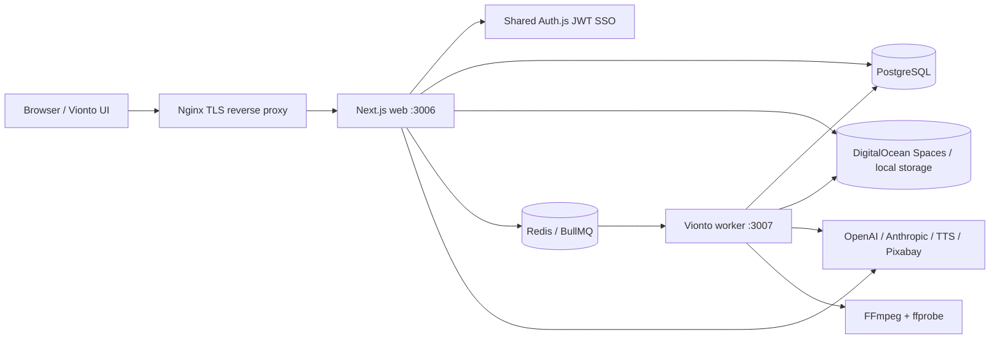
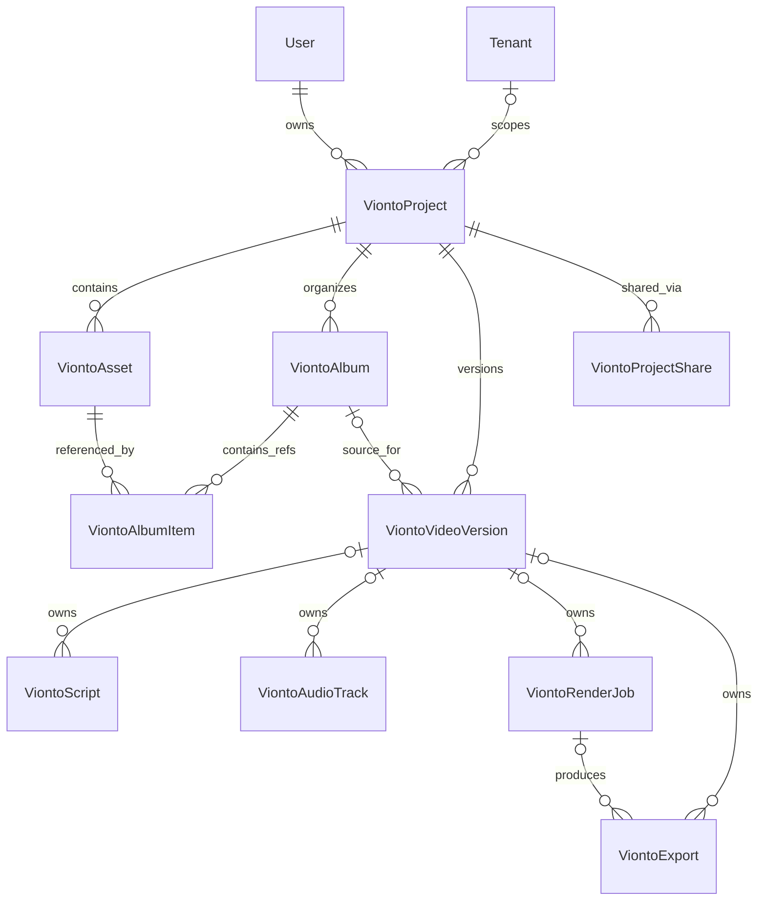
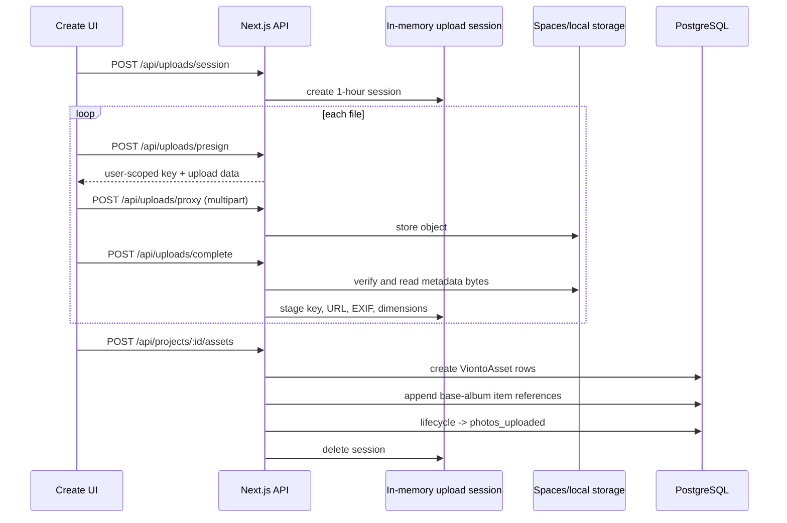
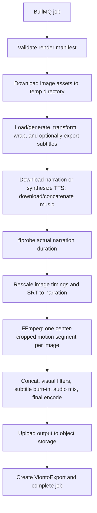

# Vionto Technical Architecture and End-to-End Flow

**Repository:** `asafarim-digital`  
**Application:** `apps/vionto`  
**Document date:** 2026-07-15  
**Scope:** Current implementation in the repository, not only the original project plan.

## 1. Executive summary

Vionto is a Next.js 16 and React 19 photo-to-video application inside the ASafariM pnpm/Turborepo monorepo. It converts a user's source images into one or more narrated video outputs. The web application owns the interactive workflow and API surface; a separate BullMQ worker performs CPU-heavy FFmpeg rendering.

The core domain is intentionally split into three levels:

1. A **project** is the ownership and source-media boundary.
2. An **album** is a non-destructive subset and ordering of project assets. Albums do not copy image files.
3. A **video version** is a render configuration, normally linked to one album. It owns creative settings and has its own scripts, audio tracks, render jobs, and exports.

The production runtime consists of:

- the Vionto Next.js web container on port `3006`;
- PostgreSQL, accessed through the shared `@asafarim/db` Prisma client;
- Redis and the `vionto-render` BullMQ queue;
- the Vionto worker with FFmpeg/ffprobe and a health server on port `3007`;
- DigitalOcean Spaces through the S3 API for source media, audio, subtitle sidecars, and rendered exports;
- shared ASafariM Auth.js/NextAuth v5 JWT SSO;
- OpenAI and Anthropic for image captions and story writing;
- Azure Speech, ElevenLabs, and OpenAI support in the TTS layer;
- optional Pixabay and stored/user-uploaded music;
- optional Google Photos Picker import.

## 2. Repository wiring

### 2.1 Monorepo placement

The root workspace uses pnpm workspaces and Turborepo. `apps/vionto/package.json` defines the application, while shared functionality comes from workspace packages:

| Package | Responsibility in Vionto |
| --- | --- |
| `@asafarim/auth` | Auth.js configuration, login providers, JWT session, cross-subdomain cookie, route middleware |
| `@asafarim/db` | Prisma client and generated database types |
| `@asafarim/ui` | Theme and common UI primitives |
| `@asafarim/shared-i18n` | Locale cookie resolution, dictionaries, and React provider |
| `@asafarim/country-language-selector` | Locale selection UI |
| `@asafarim/vionto-schemas` | Shared schema package; most server route validation currently lives locally in `apps/vionto/lib/server/validation.ts` |

The main commands are:

```text
pnpm dev:vionto                 # web development server
pnpm dev:vionto:worker          # standalone development worker
pnpm --filter vionto build      # Next.js production build
pnpm --filter vionto typecheck  # TypeScript validation
pnpm --filter vionto test       # Vitest server/library tests
```

The app is served locally on `http://localhost:3006`. Next.js uses the App Router and standalone output. The root layout installs the theme, internationalization provider, and client-side Auth.js session provider.

### 2.2 Main application surfaces

| Surface | Role |
| --- | --- |
| `/` | Landing page |
| `/create` | Main creation workspace implemented by the large `ViontoPage` client component |
| `/projects` | Project management, search, CRUD, and sharing |
| `/albums` | Cross-project album/render/export dashboard |
| `/organizer` | Image organizer surface |
| `/api/**` | Route handlers for domain operations |

The `/create` client coordinates nearly the entire authoring flow: project selection, upload, albums, versions, creative settings, story generation, voice selection, music, subtitle settings, rendering, polling, preview, and download.

### 2.3 Runtime topology



The web process only enqueues render work; it does not instantiate the BullMQ worker. This separation keeps long FFmpeg jobs outside the Next.js request lifecycle.

## 3. Authentication, session, and authorization

### 3.1 Login providers and user provisioning

Vionto exposes `@asafarim/auth` through `/api/auth/[...nextauth]`. The shared Auth.js configuration supports:

- Google OAuth using `AUTH_GOOGLE_ID` and `AUTH_GOOGLE_SECRET`;
- email/password credentials using bcrypt hashes;
- a single-use email-code provider backed by `EmailLoginCode` records.

The email-code provider loads the newest unused and unexpired code, enforces a configurable attempt limit, compares SHA-256 hashes using a constant-time comparison, marks a successful code as used, and only returns active users.

For OAuth sign-in, `ensureAuthUser` resolves the account by provider identity, user ID, or email. If no user exists, it creates one, generates a unique username, upserts the OAuth account, and assigns the database's default role. Inactive users are rejected.

### 3.2 JWT session and cross-application SSO

Sessions use a signed JWT with a 30-day maximum age; there is no Prisma session adapter. The JWT is enriched with:

- database user ID in `sub`;
- role names;
- `tenantId`;
- username;
- email verification state;
- active/inactive state;
- current name and image.

Production uses the secure session cookie `__Secure-authjs.session-token`, scoped to `.asafarim.com` by default. This permits SSO between the portal and Vionto subdomains when they share `AUTH_SECRET`. Development uses `authjs.session-token` on `localhost`.

The centralized sign-in page lives in the portal. Unauthenticated page requests are redirected there with an absolute callback URL built from forwarded proxy headers or `AUTH_URL`. Redirect callbacks are restricted to same-origin URLs and explicitly configured ASafariM application origins.

### 3.3 Request protection layers

Vionto has two protection layers:

1. `apps/vionto/proxy.ts` runs the shared JWT middleware. It validates the exact production cookie name, rejects deactivated users, returns JSON `401` for protected API calls, and redirects protected pages to the portal.
2. API handlers call `getAuthedUser()` and apply record-level ownership/access queries.

Several route prefixes are deliberately declared public in the proxy, including `/create`, `/api/projects`, `/api/render`, `/api/exports`, and `/api/audio`. “Public” here only means the proxy does not block them. Their API handlers still require a session. Consequently, `/create` can render its shell while unauthenticated, but its data requests receive `401`.

`getAuthedUser()` resolves the JWT user against the database, first by ID and then by email. It can create a missing database user from the session as a recovery path. It returns `{ id, email, tenantId, roles }`.

The app also contains permission helpers that expand database roles into permissions and special-case `superadmin`. These are used by administrative routes, but ordinary project/album/render routes primarily enforce ownership directly rather than using permission strings.

### 3.4 Ownership and sharing behavior

`ViontoProjectShare` records contain an invite email, an optional resolved user, and `viewer` or `editor` permission. Project list/detail and video-version read routes allow either:

- the project owner;
- a share resolved to the current user ID; or
- a share whose normalized email matches the current session email.

Owner-only mutation is enforced for project updates/deletion and version creation/update/deletion.

Important current limitation: album, asset, script, audio, render, and export handlers are generally owner-only. The stored `editor` permission is not yet translated into write access, and a shared viewer cannot traverse the full creation workflow. The UI accurately treats shared projects as view-only, but the API's shared-access coverage is narrower than the complete project graph.

## 4. Persistent domain model

### 4.1 Relationship overview



All major child records also retain `projectId` and `userId`. The optional `versionId` on scripts, audio tracks, jobs, and exports preserves compatibility with data created before video versions were introduced.

### 4.2 Project

`ViontoProject` is the durable aggregate root and ownership boundary. It stores title, description, locale, tenant, retention policy, and legacy/default creative settings:

- mode, story mode, emotional tone, and visual style;
- subtitle configuration;
- music selection and metadata;
- aspect ratio, resolution, and target duration;
- a coarse project status.

The current creation route writes `status = draft`. Render state is tracked on `ViontoRenderJob`, and authoring progress is tracked on the album lifecycle; the main render flow does not currently move the project status through `ready`, `rendering`, and `completed`.

Deleting a project cascades through assets, albums/items, versions, scripts, audio, jobs, exports, and shares. Storage objects are not transactionally deleted by the project-delete route, so database cascade and object-store cleanup are separate concerns.

### 4.3 Assets

`ViontoAsset` is a source or derived media record. Source images contain object keys, display URLs, dimensions, size, project-level order, EXIF metadata, optional AI caption provenance, and moderation fields.

The project asset order is the canonical fallback order when no album is selected. Deleting an asset removes its original and thumbnail objects best-effort, then deletes the database row. Cascading album-item relations remove every reference to that asset.

### 4.4 Albums and album items

An album is a metadata/reference layer over project assets. It never duplicates the source object. Each `ViontoAlbumItem` links one asset to one album and adds:

- an album-specific `orderIndex`;
- up to 8 KB of free-form semantic metadata;
- `hidden` and `favorite` flags.

The unique `(albumId, assetId)` constraint prevents duplicate image references in one album. The same asset may appear in many albums with different order and metadata.

Every newly created project receives one **Base album** with `isBase = true`. Application logic, rather than a partial unique database constraint, enforces the expectation of one base album. Older projects are repaired lazily: album-list and asset-promotion routes create a missing base album and backfill its items from project assets.

Derived albums may be:

- empty;
- seeded from every base-album item;
- seeded from a validated subset of project asset IDs.

Albums also store cover asset ID, arbitrary metadata, collections, favorite status, dates, location, people, occasion, mood, and privacy level. The base album cannot be deleted, and its items cannot be removed through the album-item deletion endpoint; the underlying project asset must be deleted instead.

Album ordering can be changed explicitly or automatically:

- explicit reorder assigns sequential indexes in one Prisma transaction;
- date sort uses EXIF timestamp with asset creation time as fallback;
- location sort groups GPS coordinates rounded to two decimal places, sorts within clusters by time, and puts images without GPS into a final group.

### 4.5 Album lifecycle

Album lifecycle is monotonic and consists of:

```text
draft
  -> photos_uploaded
  -> story_generated
  -> audio_ready
  -> video_rendered
  -> published_exported
```

`advanceAlbumLifecycleStage` only advances when the target rank is greater than the stored rank. If an explicit album is absent, it updates the project's base album. Promotion, story generation, voice/audio selection, render completion, and export creation call this helper at their respective stages.

In practice the worker creates an export as part of a successful render and advances directly to `published_exported`; `video_rendered` mainly covers a completed job observed without an export.

### 4.6 Video versions

`ViontoVideoVersion` represents one configured output of a project. It can point to an album, or use all project assets when `albumId` is null. It owns:

- a user-facing name;
- optional template ID and template snapshot;
- mode, story mode, emotional tone, and visual style;
- subtitle settings;
- music selection/upload key/metadata;
- aspect ratio, resolution, and duration;
- structured opening, chapters, climax, closing, and dedication;
- caption-overlay preferences.

Project creation atomically creates `Version 1` linked to the base album. Additional versions can start from defaults, a template, or a clone of another version. Cloning copies creative configuration but not scripts, audio tracks, jobs, or exports. The API prevents deletion of the only version.

When the active version is patched, supported creative fields are also written back to `ViontoProject` on a best-effort basis. This is a compatibility bridge for routes and old records that still read project-level settings. The version remains authoritative when a `versionId` is passed to story or render APIs.

Templates prefill settings and are snapshotted into `templateSettings`; later template-code changes therefore do not erase the record of what was applied.

## 5. Project and media creation flow

### 5.1 Project creation transaction

The browser submits title, template, creative choices, locale, aspect ratio, and duration to `POST /api/projects`. Zod enforces a 120-character title, supported modes/styles/aspect ratios/resolutions, and a 15–90 second duration in five-second increments.

The server performs one Prisma transaction:

1. Create the project with template defaults overridden by request values.
2. Create the base album.
3. Create `Version 1`, linked to that album, with the effective creative settings and optional template snapshot.

This transaction prevents a new project from existing without its default album and version.

### 5.2 Browser upload and promotion



Storage keys have the form:

```text
vionto/{userId}/{category}/{sessionOrProjectId}/{uuid}/{safeFilename}
```

Routes check that the key begins with the authenticated user's namespace. Filenames are sanitized; image, audio, video, and archive MIME types are allow-listed. The general presign schema currently applies a 50 MB upper bound per object, while Nginx allows request bodies up to 500 MB.

Although the API creates a presigned upload URL, the current web UI sends files through `/api/uploads/proxy`. This keeps authentication and local-storage behavior uniform but makes the Next.js/Nginx path carry the bytes.

On completion the server verifies object existence, derives the public URL, reads up to the metadata limit, extracts trusted dimensions and EXIF, and appends the staged asset to the session. Promotion creates database assets in the user's chosen order, then adds references to the base album without duplicating objects.

Upload sessions are process-local Maps with a one-hour TTL extended on activity. They are not stored in Redis or PostgreSQL. A web-process restart loses sessions, and multiple web replicas would require sticky routing or a durable session implementation. The current deployment uses one Vionto web container.

### 5.3 Google Photos import

Google Photos authorization is separate from login identity. A signed-in user grants incremental Picker access through a dedicated OAuth flow. Access and refresh tokens are stored encrypted with AES-256-GCM in `GooglePhotosConnection` using `VIONTO_TOKEN_ENCRYPTION_KEY`.

The import sequence creates a Google Picker session, sends the user to Google's picker, polls for completion, lists selected items server-side, downloads them, stores them under the same user-scoped storage namespace, and stages them in the same Vionto upload session. From promotion onward, imported and manually uploaded images follow the identical asset/base-album path.

Direct shared-album URL resolution is feature-gated; the supported general path is picker-first because of Google Photos Library API restrictions.

## 6. Story and narration preparation

### 6.1 Settings resolution

Before generation, the client persists active creative settings. If a version is selected, it patches the version and relies on the compatibility sync to the project. Otherwise it patches the project directly.

`POST /api/story/generate` resolves each setting in this precedence order:

```text
explicit request value -> selected video version -> project -> hard-coded default
```

The album is resolved as explicit request album, then version album, then all project assets. For an album, only non-hidden source-image items are used and their album-specific order and metadata are preserved.

### 6.2 Vision captions and story prompt

The server finds images without captions and attempts to caption at most five per generation request to control latency. `generateImageCaption` downloads the object and tries configured vision providers. Captions store provider, model, and generation timestamp on the asset.

The story context combines:

- ordered image captions;
- album-item semantic metadata appended to the relevant caption;
- server-derived EXIF date/location summary;
- locale, mode, genre, tone, and visual style;
- user notes, limited to 2,000 characters;
- target duration;
- optional story structure from the version.

The story provider order is OpenAI first and Anthropic fallback. The provider wrapper records model, token counts, and latency. The model is asked for narration and SRT-compatible output. If its response is plain text or has invalid/missing SRT, the server deterministically generates SRT cues over the configured target duration.

The resulting `ViontoScript` is attached to the selected version when present, includes prompt version `vionto-story-v1`, and snapshots the music option used at generation time. User edits update narration/SRT and set `isUserEdited = true`; regeneration creates another script record rather than overwriting provenance.

### 6.3 Voice and audio selection

The voice catalog spans provider-specific voices and locales. Voice preview accepts at most 200 characters and returns base64 MP3 audio to the browser.

Selecting a narration voice creates or updates a `ViontoAudioTrack` with `type = narration`, `source = tts`, no storage key, and the provider-facing voice choice. This is a preference record: full narration TTS is normally synthesized later by the worker. A stored narration object can instead be attached by setting `storageKey`.

TTS dispatch prefers the provider belonging to the selected catalog voice, then fallback providers. The implementation supports Azure, ElevenLabs, and OpenAI, although the default fallback list passed by `synthesizeSpeech` is Azure then ElevenLabs. Provider errors carry retryability metadata.

Music may come from:

- metadata containing renderable Spaces keys or HTTP download URLs;
- a user's uploaded object;
- the common/user music library in Spaces;
- a Pixabay category, where the server selects a track appropriate to target duration.

## 7. Detailed video generation and rendering flow

### 7.1 Render submission and manifest assembly

The client first verifies that a project, images, and narration exist. It then saves version/project settings and subtitle settings before calling `POST /api/render` with `projectId` and normally `versionId`.

The route verifies project ownership and loads project settings. If `versionId` is present, the version's creative settings replace the project defaults while locale remains project-scoped. Effective album precedence is:

```text
explicit render album -> version album -> all project assets
```

The route creates a `ViontoRenderJob` in `queued` state, then builds a render manifest:

1. Load non-hidden album assets in album order, or all source assets in project order.
2. Load the newest usable script for the selected version scope.
3. Load audio tracks for the selected version scope.
4. Require at least one stored image, a narration script, and a narration voice or stored narration track.
5. Resolve target duration, defaulting to 30 seconds when unset.
6. Run smart pacing for exactly the selected asset IDs.
7. Resolve music from stored metadata/upload or Pixabay.
8. Resolve subtitle preset/style/timing/export options.
9. Validate the complete manifest with Zod.
10. Enqueue `{ jobId, manifest }` on BullMQ queue `vionto-render`.

The manifest is the contract between the web app and worker. It includes identity and scope, ordered assets, per-image duration/motion/transition, output geometry and codecs, narration/SRT, subtitle styling, audio tracks, story metadata, retry count, and timeout metadata. It accepts 1–200 assets and up to 16 audio tracks.

Smart pacing uses persisted image captions/metadata and scoring logic to allocate duration and choose motion/transition suggestions based on emotional tone and story mode. The route retains the user's target duration as the contract even if the initial pacing sum differs slightly.

### 7.2 Queue and job state

The queue and worker share `REDIS_URL` and queue name `vionto-render`. One worker process handles one render at a time because FFmpeg is CPU-intensive. The database job state machine used in code is:

```text
queued -> running -> completed
   |         |
   |         +-> cancelled
   +------------> failed
   +<---- retryable failure (delayed requeue of same DB job)
```

Progress milestones are stored in PostgreSQL. The create UI polls `/api/render/:jobId` every two seconds. A separate SSE endpoint also exists, polling the database every three seconds, sending 15-second heartbeats, and closing on a terminal state or after ten minutes; the main create UI currently uses polling rather than SSE.

### 7.3 Worker processing stages



#### Stage A: validation and materialization

The worker validates the manifest again, creates `{tmp}/vionto-renders/{jobId}`, checks cancellation, marks the job running at 5%, and downloads every image from object storage. Image completion moves progress to 15%.

#### Stage B: subtitles

Subtitle input precedence is stored SRT key, inline SRT text, then generated cues from narration when burn-in is enabled. The worker:

- parses cues;
- applies uppercase/lowercase/sentence transforms;
- wraps text to configured width and line count;
- writes a local SRT;
- optionally uploads SRT and/or VTT sidecars;
- only passes the SRT to FFmpeg when burn-in is enabled.

Burn-in styling is converted to FFmpeg's ASS subtitle options, including font, size, weight, colors, outline, background opacity, shadow, alignment, and margins.

#### Stage C: narration and music

If the narration track has a storage key, the worker downloads it. Otherwise it synthesizes the full script using the selected voice. Music tracks are downloaded from storage or HTTP URLs; multiple tracks are first concatenated to AAC.

The worker uses ffprobe to measure actual narration duration. Because provider speech speed rarely equals the requested duration exactly, it rescales all image segment lengths to the measured narration length and rescales SRT timestamps to the same time window. Each image is clamped to at least one second, so extremely short narration or very large image sets can still make the final sum exceed narration slightly.

#### Stage D: image segments

For every image, FFmpeg:

- loops the still image at the configured frame rate;
- scales it to fill the output frame;
- center-crops to the exact dimensions;
- applies a zoom/pan/Ken Burns expression;
- encodes an H.264/YUV420p silent segment of the allocated duration.

Base resolution is 1280×720, 1920×1080, or 3840×2160 and is reshaped to 16:9, 9:16, 1:1, or 4:3 with even dimensions.

The pacing/manifest model contains transition presets, but the current FFmpeg builder concatenates complete segments through the concat demuxer and does not apply `xfade` or slide transitions. Motion presets are active; transition values are presently descriptive/future-facing.

#### Stage E: final encode and mix

The final FFmpeg command concatenates segments, reapplies exact scale/crop, applies the selected visual-style filter chain, optionally burns subtitles, and maps audio.

Implemented visual treatments include film grain, polaroid, travel grid, VHS, wedding, social-caption band, and clean slideshow. When narration and music both exist, the active pipeline uses narration volume `1.0`, music volume `0.06`, and `amix` ending with narration. A more sophisticated EBU loudness/sidechain-ducking builder exists in `audio-mix.ts`, but it is not currently used by `buildRenderCommand`; per-track mix settings from the API are also not applied by the final mix command.

The manifest exposes MP4/MOV/WebM and codec choices, but the worker currently names its local output `output.mp4`, uploads it as `video/mp4`, and export filename generation always returns `.mp4`. The ordinary web-generated manifest defaults to MP4/H.264/AAC.

#### Stage F: export and completion

After encoding, the worker:

1. derives keywords from narration and project title;
2. generates a timestamped filename containing mode, aspect label, and keywords;
3. uploads the final file under the user's `exports` namespace;
4. creates `ViontoExport` linked to project, version, and render job;
5. snapshots format, resolution, duration, aspect, visual style, story mode, tone, music, filename, preview title, and search keywords;
6. marks the job `completed` at 100%;
7. advances the version's album to `published_exported`;
8. deletes the temporary directory in production.

The stored `durationSeconds` currently uses the manifest target rather than the ffprobe-measured final output duration.

### 7.4 Errors, retries, and cancellation

The worker classifies failures into FFmpeg missing/failure, disk full, TTS, timeout, network, and unknown categories. TTS, timeout, network, and unknown errors are retryable. It increments `retryCount` and requeues the same DB job with a five-second-per-attempt delay up to `manifest.maxRetries` (default three).

The manual `/api/render/:jobId/retry` endpoint creates a new job but currently constructs an empty-asset placeholder manifest. Since the manifest requires at least one asset and a job ID, this manual retry path is not functionally equivalent to the worker's automatic retry and will fail validation unless it is redesigned to persist/reconstruct the original manifest.

Cancellation writes `state = cancelled`. The worker checks that flag before starting, before encoding, and between segment commands. It does not terminate an FFmpeg child process already in progress, so cancellation becomes effective at the next checkpoint.

### 7.5 Progress and download

The polling endpoint returns state, percent, retry count, last logs, error summary, timestamps, and newest export. On completion the UI loads the export library.

`GET /api/exports/:exportId/download` verifies ownership and completed render state, creates a 15-minute presigned GET URL, stores that URL and its expiry on the export row, and returns download metadata. Export-library previews use ten-minute presigned URLs.

Deleting an export currently removes only the database row; it does not delete the underlying storage object. The share endpoint returns a constructed token/URL and expiry but there is no matching public `/share/:token` route or persisted token in the current app, so it is a placeholder rather than a complete public-sharing mechanism.

## 8. API map

The following groups define the main workflow. Unless stated otherwise, mutations are owner-only.

| Group | Important endpoints | Purpose |
| --- | --- | --- |
| Auth | `/api/auth/[...nextauth]`, `/api/me` | Auth.js handlers and session profile |
| Projects | `/api/projects`, `/api/projects/:id`, `/shares` | CRUD, list owned/shared, share invitations |
| Assets/uploads | `/api/uploads/session`, `/presign`, `/proxy`, `/complete`, `/projects/:id/assets` | Stage objects and promote durable source assets |
| Albums | `/projects/:id/albums`, `/albums/:albumId`, `/items`, `/reorder`, `/sort` | Non-destructive collections and ordering |
| Versions | `/projects/:id/versions`, `/versions/:versionId` | Create, clone, select album, edit creative settings |
| Story | `/api/story/generate`, `/story/:scriptId`, `/regenerate`, `/projects/:id/scripts` | AI generation, edit, history |
| Subtitles | `/projects/:id/subtitles` | Project- or version-scoped subtitle configuration |
| Audio/music | `/api/audio/voices`, `/preview`, `/tracks`, `/music/library`, `/music/pixabay` | Voice, TTS preview/preference, music selection |
| Render | `/api/render`, `/render/:jobId`, `/events`, `/retry` | Queue, status/cancel, SSE, manual retry |
| Exports | `/api/exports`, `/library`, `/:id/download`, `/:id/share` | History, previews, download, placeholder sharing |
| Google Photos | `/connect`, `/callback`, `/status`, `/picker/session`, `/import`, `/disconnect` | Separate OAuth and picker-based import |
| Operations | `/api/health`, `/api/admin/retention-enforce`, `/api/admin/support/lookup` | Health and privileged administration |

## 9. Storage and database consistency

Production storage uses DigitalOcean Spaces if all S3 configuration is present and `VIONTO_STORAGE_DRIVER` permits it. Development defaults to filesystem storage under `apps/vionto/.local-storage/uploads`, with a memory cache for faster access. Download and upload helpers transparently select the driver.

The database and object store do not share a transaction. Notable behavior:

- asset deletion removes storage objects best-effort before deleting the row;
- project deletion relies on database cascade and does not enumerate storage objects;
- export deletion removes the row but not the video object;
- failed promotion can leave uploaded session objects without asset rows;
- retention enforcement contains separate cleanup logic and should remain the long-term reconciliation point.

`ViontoAuditEvent`, `ViontoUsageMetric`, and `ViontoPlanQuota` exist in the schema. Admin support can read usage records and plan quotas are seeded, but the main upload/story/render routes do not currently record usage, enforce quotas, or populate the Vionto-specific audit trail. These tables describe the intended operational model more than the current request path.

## 10. Deployment and operations

### 10.1 Containers

The web image is a Node 22 Alpine multi-stage Next.js standalone build. It generates Prisma for Alpine and runs as a non-root `nextjs` user on port `3006`.

The worker image installs FFmpeg, fontconfig, and Liberation fonts, bundles `worker.ts` with tsup, generates the Prisma client for Alpine, and runs as a non-root `worker` user. Docker Compose limits it to two CPUs and 4 GB RAM and deploys one replica.

Both services depend on successful database migration and healthy Redis. Both receive the same database, Redis, storage, and AI configuration. The worker health endpoint checks process state, Redis ping, database query, and storage configuration.

### 10.2 Nginx and CI/CD

Nginx terminates TLS, forwards public-origin headers required by Auth.js callbacks, allows 500 MB request bodies, disables request buffering for uploads, and gives long API proxy timeouts for media operations.

The GitHub deployment workflow rsyncs the monorepo to the VPS, installs Nginx configurations, starts PostgreSQL/Redis, builds application images, runs Prisma migrations, conditionally seeds initial data, recreates the services, and verifies web/worker health.

### 10.3 Essential environment variables

| Area | Variables |
| --- | --- |
| URLs | `NEXT_PUBLIC_VIONTO_URL`, `NEXT_PUBLIC_PORTAL_URL`, `PORTAL_URL`, `AUTH_URL` |
| Auth | `AUTH_SECRET`, `AUTH_COOKIE_DOMAIN`, `AUTH_GOOGLE_ID`, `AUTH_GOOGLE_SECRET`, `EMAIL_CODE_MAX_ATTEMPTS` |
| Database/queue | `DATABASE_URL`, `REDIS_URL` |
| Storage | `VIONTO_STORAGE_DRIVER`, `VIONTO_LOCAL_STORAGE_DIR`, `DO_SPACES_ENDPOINT`, `DO_SPACES_REGION`, `DO_SPACES_BUCKET`, `DO_SPACES_KEY`, `DO_SPACES_SECRET`, `DO_SPACES_PUBLIC_URL` |
| Story/vision | `OPENAI_API_KEY`, `OPENAI_MODEL`, `OPENAI_MAX_OUTPUT_TOKENS`, `OPENAI_VISION_MODEL`, `ANTHROPIC_API_KEY`, `ANTHROPIC_MAX_TOKENS`, `ANTHROPIC_VISION_MODEL` |
| TTS/music | `AZURE_SPEECH_KEY`, `ELEVENLABS_API_KEY`, `PIXABAY_API_KEY` |
| Worker | `WORKER_HEALTH_PORT`, `FFMPEG_PATH`, `FFPROBE_PATH` |
| Google Photos | `GOOGLE_PHOTOS_CLIENT_ID`, `GOOGLE_PHOTOS_CLIENT_SECRET`, `GOOGLE_PHOTOS_REDIRECT_URI`, `GOOGLE_PHOTOS_SCOPES`, `GOOGLE_PHOTOS_SHARING_ENABLED`, `VIONTO_TOKEN_ENCRYPTION_KEY` |

Production Compose currently passes OpenAI and ElevenLabs keys to web and worker but does not explicitly pass Anthropic, Azure Speech, Pixabay, or Google Photos variables in the shown Vionto service blocks. Those features therefore require Compose/deployment environment wiring in addition to defining the variables in the root environment.

## 11. Current implementation caveats and hardening priorities

These points are observable current behavior and should be considered when extending or operating the system:

1. **Custom render manifest trust:** `POST /api/render` accepts an optional fully supplied manifest, validates its shape, but does not overwrite or bind its `userId`, `projectId`, `jobId`, asset keys, or version ID to the authenticated request and newly created job. The normal UI does not send a manifest, but this API path should be removed or server-bound before being treated as an external contract.
2. **In-memory upload sessions:** sessions disappear on restart and are unsafe across multiple web replicas. Redis is the natural durable replacement.
3. **Shared-project coverage:** sharing grants project/version read access, not complete album/asset/script/export traversal, and `editor` does not yet enable mutations.
4. **Manual retry is incomplete:** it queues an invalid placeholder manifest instead of the original render input.
5. **Project status is not the render state:** consumers should read render-job state and album lifecycle, not expect project status transitions.
6. **Transition and overlay gap:** transition presets and `captionOverlays` exist in the contract, but the current FFmpeg pipeline does not render crossfades/slides or generate per-asset caption overlay entries. Subtitle burn-in is implemented.
7. **Audio settings gap:** stored per-track mix settings and the advanced ducking helper are not connected to the active final mix.
8. **Format mismatch:** non-MP4 manifest values are accepted, but output path, MIME type, and filename are MP4-specific.
9. **Object cleanup gaps:** project/export deletion can leave orphaned storage objects; a reconciliation or lifecycle policy is needed.
10. **Quota/audit scaffolding:** schema and seed data exist, but primary media routes do not yet meter or enforce them.
11. **Permission cache lifetime:** the in-process permission cache has no TTL or explicit invalidation, so role/permission changes may remain stale until process restart.
12. **Sort and base-album invariants are application-enforced:** there is no database partial unique constraint ensuring exactly one base album per project.

## 12. Source-of-truth file guide

| Concern | Primary implementation |
| --- | --- |
| Application metadata/layout | `apps/vionto/app/layout.tsx`, `apps/vionto/next.config.ts` |
| Main authoring orchestration | `apps/vionto/components/ViontoPage.tsx` |
| Auth configuration | `packages/auth/src/index.ts`, `providers.ts`, `middleware.ts` |
| Vionto auth/guards | `apps/vionto/lib/server/auth.ts`, `apps/vionto/proxy.ts` |
| Database models | `packages/db/prisma/schema.prisma` |
| Project/version APIs | `apps/vionto/app/api/projects/**` |
| Album APIs/lifecycle | `apps/vionto/app/api/projects/[projectId]/albums/**`, `lib/server/album-lifecycle.ts` |
| Upload/storage | `apps/vionto/app/api/uploads/**`, `lib/server/upload-session.ts`, `storage.ts`, `validation.ts` |
| Story/vision/SRT | `app/api/story/**`, `lib/server/story-generation.ts`, `vision.ts`, `srt.ts`, `exif.ts` |
| Render submission | `apps/vionto/app/api/render/route.ts` |
| Render contract | `apps/vionto/lib/server/render-manifest.ts` |
| Queue and worker | `apps/vionto/lib/server/queue.ts`, `apps/vionto/worker.ts` |
| Pacing | `apps/vionto/lib/server/smart-pacing.ts`, `pacing.ts`, `image-scoring.ts` |
| FFmpeg/audio/TTS | `apps/vionto/lib/server/ffmpeg.ts`, `audio-mix.ts`, `tts.ts` |
| Export metadata/download | `apps/vionto/lib/server/export-metadata.ts`, `app/api/exports/**` |
| Google Photos | `apps/vionto/lib/server/google-photos/**`, `app/api/integrations/google-photos/**` |
| Production wiring | `apps/vionto/Dockerfile`, `infra/docker/Dockerfile.vionto-worker`, `docker-compose.yml`, `infra/nginx/vionto.asafarim.com.conf` |

---

This document describes the checked-in behavior as of the date above. Where database comments or planning documents differ from executable route/worker code, the executable implementation is treated as authoritative and the mismatch is called out explicitly.

